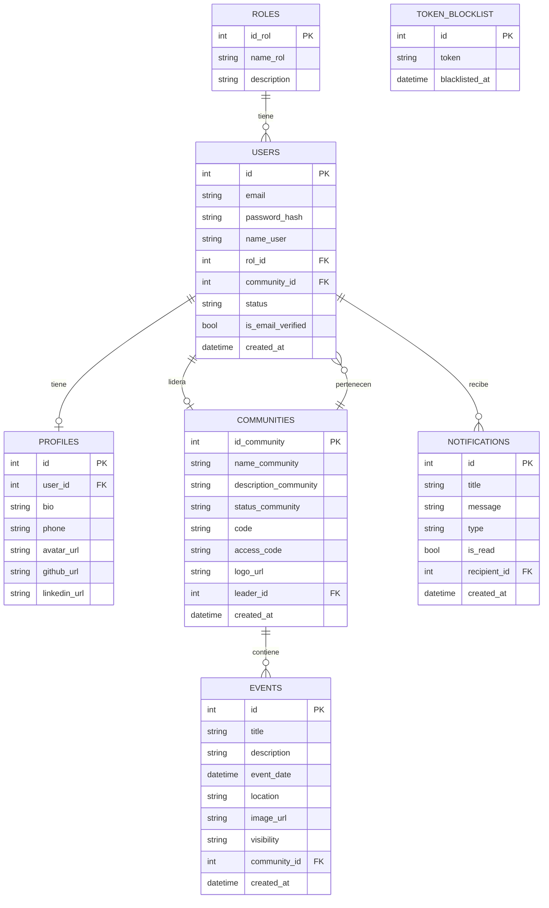

# CTech — Diagrama Entidad-Relación (MER)

> Diagrama de las tablas de la base de datos PostgreSQL, generado a partir de los modelos SQLAlchemy del proyecto.

---

## Diagrama Mermaid

---

## Descripción de Tablas

### `roles`
Catálogo de roles del sistema. Se crea con el seed inicial.

| Campo | Tipo | Descripción |
|---|---|---|
| `id_rol` | PK | Identificador del rol |
| `name_rol` | VARCHAR(50) | Nombre único del rol (`admin`, `leader`, `user`) |
| `description` | TEXT | Descripción del rol |

### `users`
Usuarios registrados en la plataforma.

| Campo | Tipo | Descripción |
|---|---|---|
| `id` | PK | Identificador del usuario |
| `email` | VARCHAR(150) | Email único — usado como credencial de login |
| `password_hash` | TEXT | Contraseña hasheada con bcrypt |
| `name_user` | VARCHAR(150) | Nombre del usuario |
| `rol_id` | FK → roles | Rol asignado |
| `community_id` | FK → communities | Comunidad a la que pertenece |
| `status` | VARCHAR(50) | Estado (`active`, `inactive`) |
| `is_email_verified` | BOOL | Si el email fue verificado |
| `created_at` | DATETIME | Fecha de registro |

### `profiles`
Información extendida del perfil de cada usuario (1:1 con `users`).

| Campo | Tipo | Descripción |
|---|---|---|
| `id` | PK | Identificador del perfil |
| `user_id` | FK → users | Usuario dueño del perfil |
| `bio` | TEXT | Biografía / descripción personal |
| `phone` | VARCHAR(20) | Teléfono de contacto |
| `avatar_url` | VARCHAR(255) | URL de foto de perfil (Cloudinary) |
| `github_url` | VARCHAR(255) | Perfil de GitHub |
| `linkedin_url` | VARCHAR(255) | Perfil de LinkedIn |

### `token_blocklist`
Almacena tokens JWT invalidados al hacer logout.

| Campo | Tipo | Descripción |
|---|---|---|
| `id` | PK | Identificador |
| `token` | TEXT | Token JWT bloqueado |
| `blacklisted_at` | DATETIME | Fecha de invalidación |

### `communities`
Comunidades tecnológicas de la plataforma.

| Campo | Tipo | Descripción |
|---|---|---|
| `id_community` | PK | Identificador de la comunidad |
| `name_community` | VARCHAR(150) | Nombre de la comunidad |
| `description_community` | TEXT | Descripción |
| `status_community` | VARCHAR(150) | Estado (`active`, `inactive`) |
| `code` | VARCHAR(50) | Código de acceso único — compartido por el líder en persona |
| `access_code` | VARCHAR(50) | Código alternativo de acceso |
| `logo_url` | VARCHAR(255) | Logo de la comunidad (Cloudinary) |
| `leader_id` | FK → users | Usuario líder de la comunidad |
| `created_at` | DATETIME | Fecha de creación |

### `events`
Eventos tecnológicos (públicos o privados según lógica de negocio).

| Campo | Tipo | Descripción |
|---|---|---|
| `id` | PK | Identificador del evento |
| `title` | VARCHAR(255) | Título del evento |
| `description` | TEXT | Descripción del evento |
| `event_date` | DATETIME | Fecha y hora del evento |
| `location` | VARCHAR(255) | Lugar (dirección o enlace para virtuales) |
| `image_url` | TEXT | Imagen del lugar del evento (Cloudinary) |
| `visibility` | VARCHAR(50) | `publico` o `privado` |
| `community_id` | FK → communities | Comunidad a la que pertenece |
| `created_at` | DATETIME | Fecha de registro |

### `notifications`
Alertas del sistema para administradores, líderes y usuarios.

| Campo | Tipo | Descripción |
|---|---|---|
| `id` | PK | Identificador |
| `title` | VARCHAR(150) | Título de la alerta |
| `message` | TEXT | Cuerpo de la notificación |
| `type` | VARCHAR(50) | Categoría (`event`, `user`, `info`) |
| `is_read` | BOOL | Estado de lectura |
| `recipient_id` | FK → users | Usuario que recibe la alerta (null = admin) |
| `created_at` | DATETIME | Fecha de envío |
---

## Relaciones Clave

| Relación | Cardinalidad | Descripción |
|---|---|---|
| `roles` → `users` | 1:N | Un rol puede tener muchos usuarios |
| `users` → `profiles` | 1:1 | Cada usuario tiene un único perfil extendido |
| `communities` → `users` | 1:N | Una comunidad tiene muchos miembros |
| `communities` → `events` | 1:N | Una comunidad agrupa múltiples eventos |
| `users` (recipient) → `notifications` | 1:N | Un usuario recibe múltiples alertas segmentadas |
| `communities` → `users` (leader) | 1:1 | Restricción lógica de un líder por comunidad |
