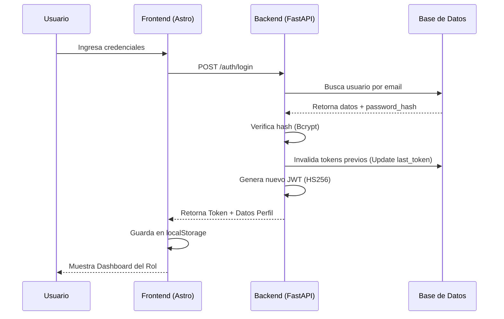
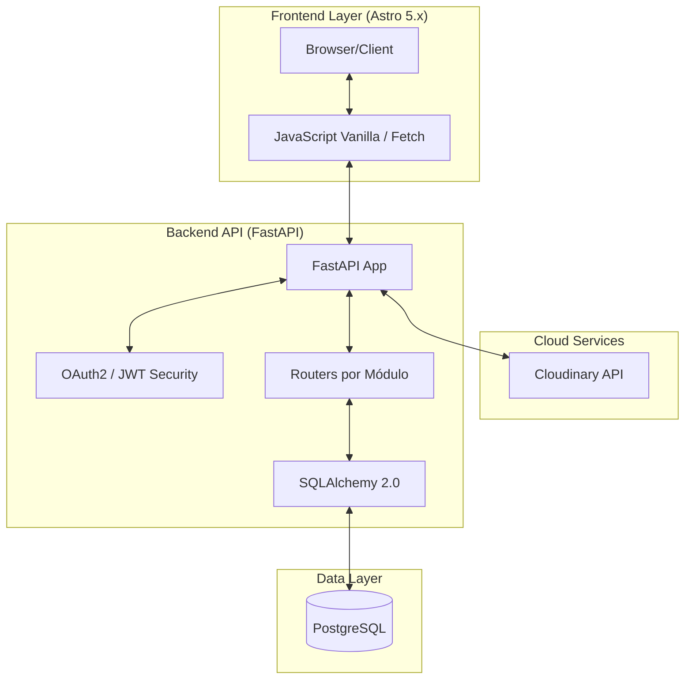
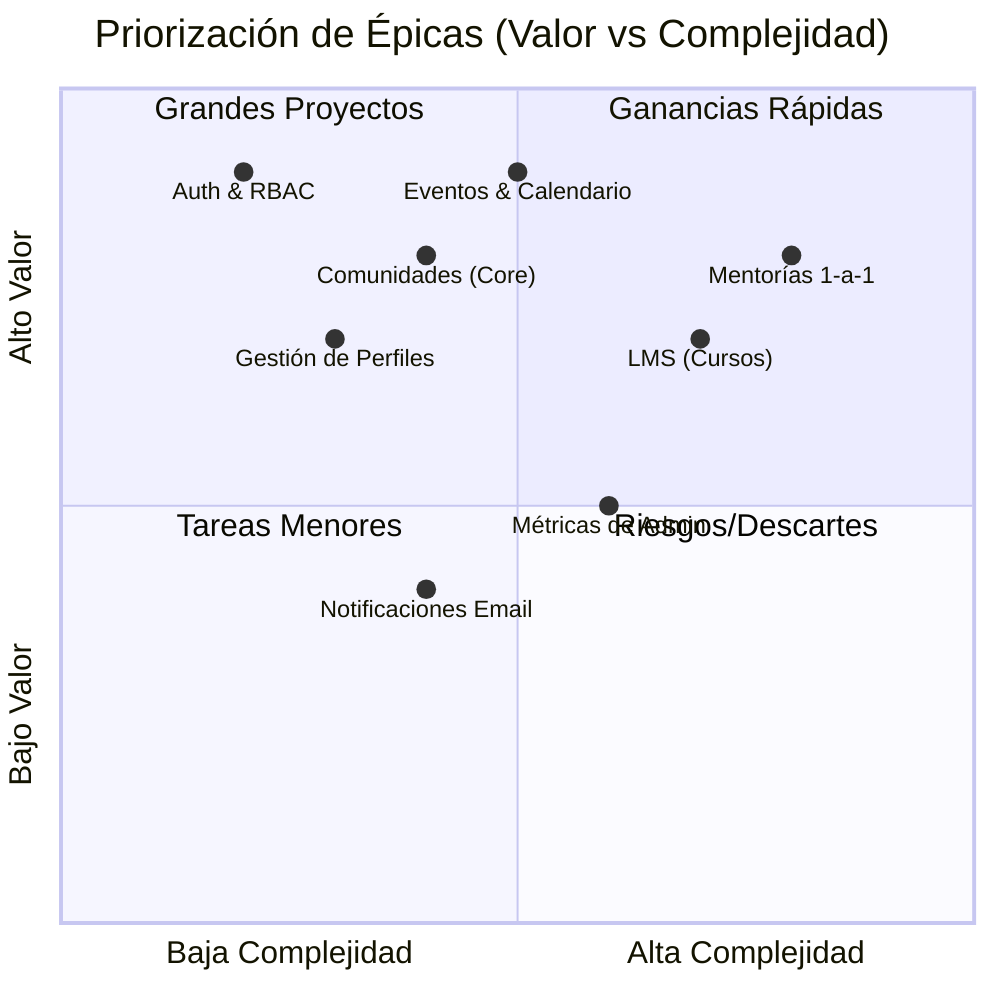
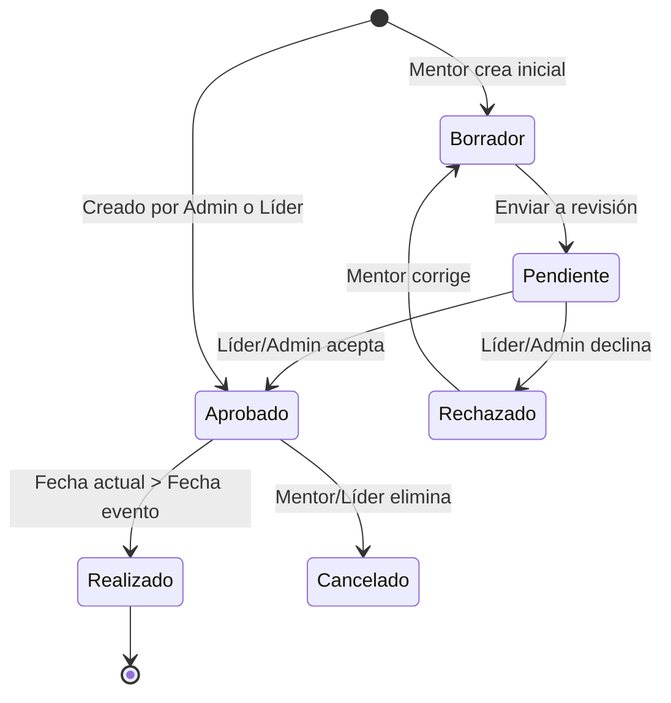

# Documentación Integral de Requerimientos y Diseño - CTech 🚀

Este documento centraliza la especificación técnica, funcional y el diseño arquitectónico de la plataforma **CTech**.

---

## 1. Mapa de Actores y Roles
- **Visitante**: Acceso público a vitrina de eventos.
- **Usuario Estándar**: Acceso a contenido privado de su comunidad.
- **Mentor**: Generador de contenido y sesiones formativas.
- **Líder**: Moderador y gestor de comunidad (relación 1-a-1).
- **Administrador**: Control global del sistema e infraestructura.

---

## 2. Diagrama de Casos de Uso (Usuario)
Este diagrama describe las interacciones de los actores con las funcionalidades clave.

```mermaid
useCaseDiagram
    actor "Visitante" as V
    actor "Usuario" as U
    actor "Mentor" as M
    actor "Líder" as L
    actor "Administrador" as A

    package "Plataforma CTech" {
        usecase "Registrarse/Login" as UC1
        usecase "Unirse a Comunidad (Código)" as UC2
        usecase "Inscribirse a Evento" as UC3
        usecase "Crear Evento/Curso" as UC4
        usecase "Aprobar Contenido" as UC5
        usecase "Gestionar Usuarios/Roles" as UC6
        usecase "Reservar Mentoría" as UC7
    }

    V --> UC1
    U --> UC2
    U --> UC3
    U --> UC7
    M --> UC4
    L --> UC5
    L --> UC2
    A --> UC6
    A --> UC5
```

---

## 3. Requisitos Funcionales (RF) - Total: 35

| ID | Requerimiento | Descripción |
|---|---|---|
| **RF01** | Registro de Usuarios | Validación de email único y perfil activo por defecto. |
| **RF02** | Autenticación JWT | Inicio de sesión seguro con tokens de 24h de duración. |
| **RF03** | Sesión Única | Invalida tokens previos al detectar un nuevo inicio de sesión. |
| **RF04** | Blocklist de Tokens | Cierre de sesión instantáneo invalidando el token en el servidor. |
| **RF05** | Perfil de Usuario | CRUD de datos personales y cambio de contraseña. |
| **RF06** | RBAC Estricto | Control de acceso basado en 4 roles jerárquicos. |
| **RF07** | Promoción de Roles | Capacidad de elevar usuarios a Mentores (Admin/Líder). |
| **RF08** | Gestión Comunidades | CRUD global de comunidades (Solo Admin). |
| **RF09** | Código de Acceso | Unión a comunidades mediante códigos compartidos por el líder. |
| **RF10** | Identidad Visual | Subida de logos a Cloudinary para comunidades y eventos. |
| **RF11** | Registro Líder-Comunidad| Restricción de un líder por comunidad (1:1). |
| **RF12** | Catálogo Tecnologías | Gestión de lenguajes y herramientas del sistema. |
| **RF13** | Creación de Eventos | Mentores pueden proponer eventos virtuales/presenciales. |
| **RF14** | Workflow Aprobación | Los eventos de terceros (si se habilitan) requieren revisión; lo creado por Admin/Líder es inmediato. |
| **RF15** | Visibilidad Pública | Fichas informativas de eventos para visitantes sin cuenta. |
| **RF16** | Inscripción Eventos | El usuario recibe confirmación inmediata y el líder una notificación de registro. |
| **RF17** | Agenda de Mentoría | Los mentores habilitan slots de tiempo para citas. |
| **RF18** | Reserva 1-a-1 | Estudiantes pueden agendar citas con mentores. |
| **RF19** | Enlaces Dinámicos | Los links de Meet/Zoom solo se ven tras la reserva confirmada. |
| **RF20** | Áreas Temáticas | Clasificación de cursos (ej. Web, Mobile, Data). |
| **RF21** | Niveles LMS | Contenido categorizado como Básico, Intermedio o Avanzado. |
| **RF22** | Gestión Cursos | Creación de rutas de aprendizaje modulares. |
| **RF23** | Notificaciones Targeted| Alertas segmentadas por `recipient_id` para líderes y usuarios (miembros). |
| **RF24** | Dashboard Admin | Métricas globales de usuarios y comunidades. |
| **RF25** | Dashboard Líder | Estadísticas de participación en su comunidad. |
| **RF26** | Dashboard Mentor | Seguimiento de sus cursos y sesiones reservadas. |
| **RF27** | Búsqueda/Filtros | Localización de eventos por especialidad y tecnología. |
| **RF28** | Auditoría de Acciones | Registro de creaciones y modificaciones críticas. |
| **RF29** | Recuperación Password | Flujo de reset vía token de seguridad por email. |
| **RF30** | Auto-Aprobación | Contenido creado por Admin/Líder se publica sin revisión. |
| **RF31** | Control de Capacidad | Validación de cupos máximos disponibles para cada evento. |
| **RF32** | Filtros de Modalidad | Consulta de eventos por tipo (Presencial / Virtual / Híbrido). |
| **RF33** | Gestión de Lectura | Capacidad de marcar notificaciones como leídas/no leídas. |
| **RF34** | Soporte Multitecnología| Asociación de múltiples tecnologías a un solo curso (vía JSON). |
| **RF35** | Cancelación Flexible | Liberación automática de slots de mentoría tras cancelación. |

---

## 4. Requisitos No Funcionales (RNF)

| ID | Requerimiento | Especificación |
|---|---|---|
| **RNF01** | Seguridad | Cifrado de contraseñas con **Bcrypt** (Passlib). |
| **RNF02** | Escalabilidad | Arquitectura modular desacoplada en el backend. |
| **RNF03** | Rendimiento | Frontend con Astro Islands para carga progresiva rápida. |
| **RNF04** | Disponibilidad | Base de datos relacional PostgreSQL con integridad referencial. |
| **RNF05** | Integración | Uso de API externa (Cloudinary) para persistencia multimedia. |
| **RNF06** | UX/UI | Diseño responsivo basado en Bootstrap 5 y CSS moderno. |
| **RNF07** | Mantenibilidad | Documentación automática con Swagger (OpenAPI). |

---

## 5. Diagrama de Actividades (Flujo de Eventos)
Describe el proceso desde que un Mentor crea un evento hasta su publicación.

```mermaid
activityDiagram
    start
    :Líder o Admin crea evento;
    :Sistema lo marca como 'Approved' (Auto-Aprobación);
    :Guardar en Base de Datos;
    :Sincronizar vinculación Líder-Comunidad;
    fork
        :Notificar a todos los Usuarios (si es Público);
    orchestrate
        :Notificar a miembros de la Comunidad (si es Privado);
    end fork
    :Enviar correo de confirmación al Creador;
    stop
```

---

## 6. Diagrama de Procesos (Login y Sesión Única)
Secuencia técnica para garantizar una sola sesión activa.



---

## 7. Diagrama de Arquitectura Tecnológica
Muestra la infraestructura y comunicación entre componentes.



---

## 8. Priorización de Épicas (Matriz de Valor)
Clasificación de las grandes funcionalidades del proyecto.



---

## 9. Diagrama de Estados (Entidad: Evento)
Ciclo de vida de un evento en la plataforma.



---

## 10. Catálogo Detallado de Casos de Uso (CU)

### 10.1 Gestión de Identidad y Acceso
- **CU-AC-01: Registro de Cuenta**: El visitante crea sus credenciales con validación de email.
- **CU-AC-02: Inicio de Sesión**: Autenticación con invalidación de sesiones previas.
- **CU-AC-03: Recuperación de Acceso**: Reset de contraseña vía token temporal.
- **CU-AC-04: Gestión de Perfil**: Edición de datos personales y preferencias.
- **CU-AC-05: Cierre de Sesión**: Destrucción segura del token en cliente y servidor.
- **CU-AC-06: Baja Voluntaria**: Eliminación permanente de la cuenta y datos.

### 10.2 Casos de Uso: Usuario Estándar
- **CU-US-01: Explorar Comunidades**: Consulta de grupos públicos disponibles.
- **CU-US-02: Unirse a Comunidad**: Ingreso mediante el código secreto del líder.
- **CU-US-03: Inscripción a Eventos**: Registro para asegurar cupo en talleres.
- **CU-US-04: Reserva de Mentoría**: Agendamiento de cita 1-a-1 según disponibilidad.
- **CU-US-05: Acceso a Contenido**: Visualización de cursos y recursos de su nivel.
- **CU-US-06: Directorio de Miembros**: Ver quiénes integran su comunidad.

### 10.3 Casos de Uso: Mentor
- **CU-MN-01: Propuesta de Evento**: Creación de evento sujeto a revisión.
- **CU-MN-02: Gestión de Agenda**: Configuración de horas para mentoría.
- **CU-MN-03: Publicación de Curso**: Subida de material educativo por módulos.
- **CU-MN-04: Dashboard de Mentor**: Métricas de impacto y alumnos asignados.
- **CU-MN-05: Edición de Contenido**: Ajustes a materiales propios publicados.

### 10.4 Casos de Uso: Líder de Comunidad
- **CU-LD-01: Moderación de Contenido**: Aprobar o rechazar eventos y cursos.
- **CU-LD-02: Gestión de Mentores**: Promover usuarios destacados al rol mentor.
- **CU-LD-03: Configuración de Comunidad**: Actualizar logo y descripción pública.
- **CU-LD-04: Dashboard de Comunidad**: Estadísticas de crecimiento y actividad.
- **CU-LD-05: Revocación de Roles**: Degradación de mentores si es necesario.

### 10.5 Casos de Uso: Administrador
- **CU-AD-01: Gestión de Infraestructura**: Alta y baja de comunidades globales.
- **CU-AD-02: Control Maestro de Usuarios**: CRUD total de perfiles y roles.
- **CU-AD-03: Gestión de Catálogos**: Mantenimiento de Tecnologías y Especialidades.
- **CU-AD-04: Auditoría de Sistema**: Monitoreo de logs y estados de salud.
- **CU-AD-05: Reportes Globales**: Exportación de métricas de toda la plataforma.
