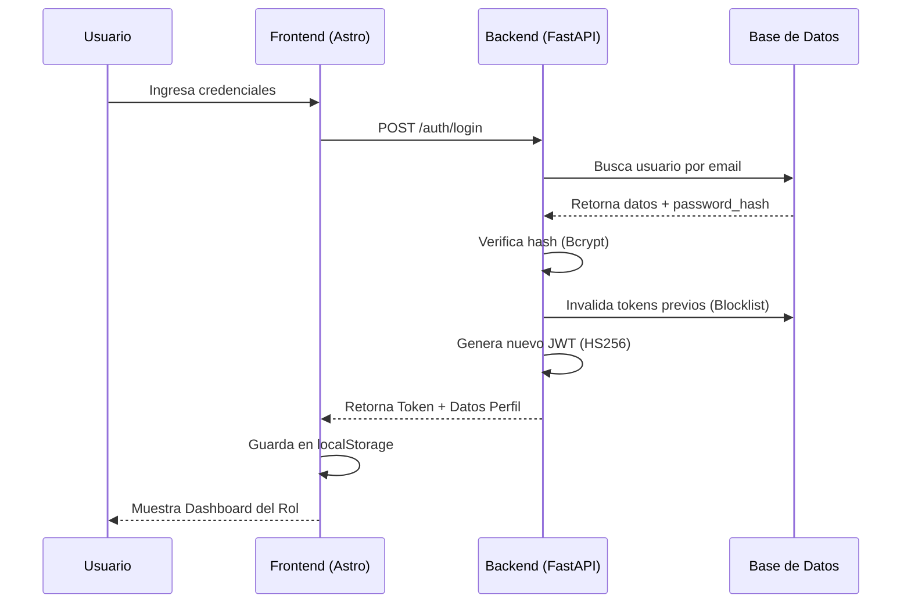
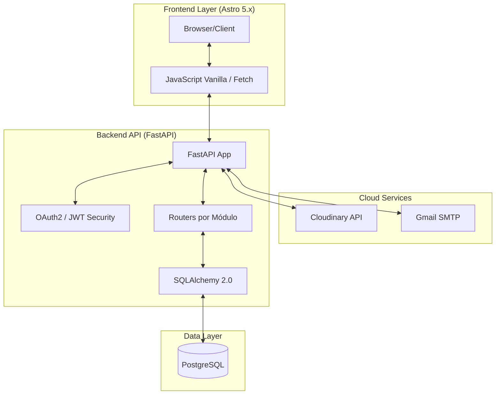
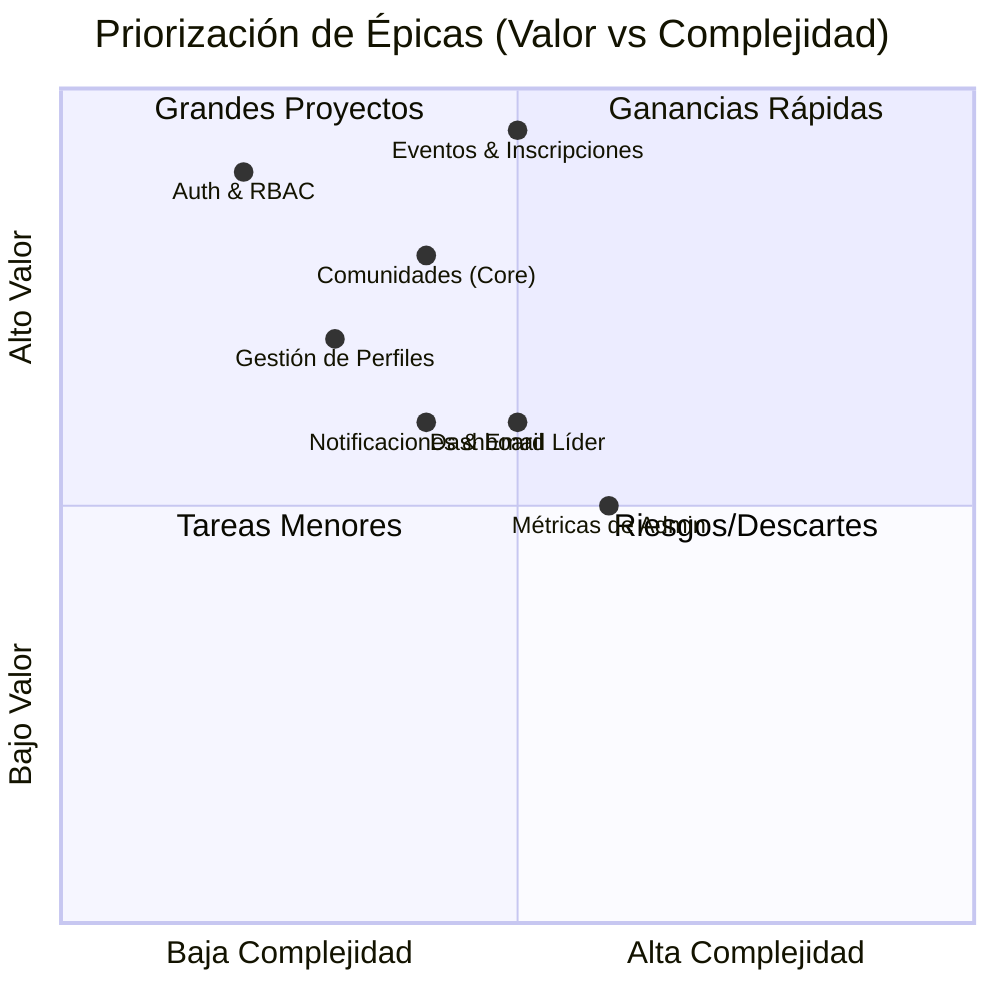
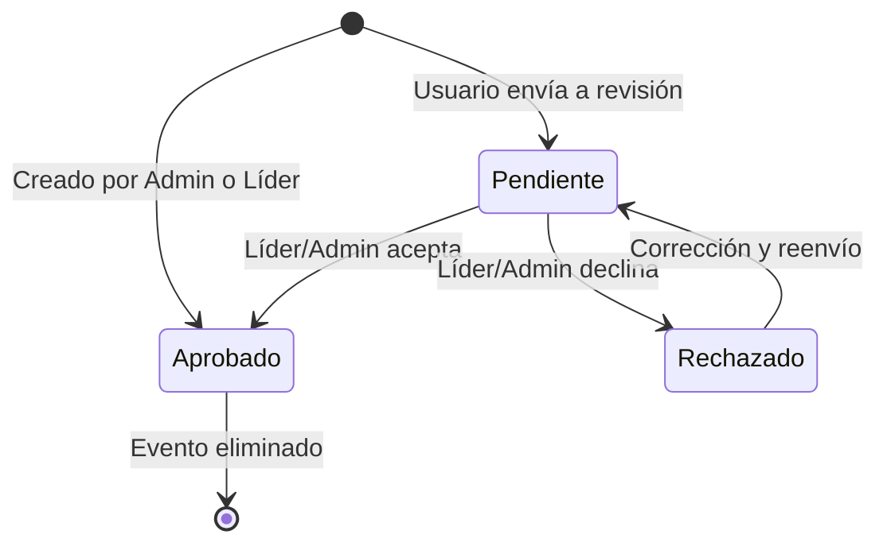

# Documentación de Requerimientos y Diseño - CTech

Este documento centraliza la especificación técnica, funcional y el diseño arquitectónico de la plataforma **CTech**.

---

## 1. Mapa de Actores y Roles

- **Visitante**: Acceso público a vitrina de eventos.
- **Usuario**: Miembro registrado de una comunidad — se inscribe a eventos.
- **Líder**: Modera y gestiona su comunidad (relación 1-a-1 con la comunidad).
- **Administrador**: Control global del sistema e infraestructura.

> El rol **Mentor** fue eliminado. CTech no gestiona mentorías ni cursos.

---

## 2. Diagrama de Casos de Uso

```mermaid
useCaseDiagram
    actor "Visitante" as V
    actor "Usuario" as U
    actor "Líder" as L
    actor "Administrador" as A

    package "Plataforma CTech" {
        usecase "Registrarse/Login" as UC1
        usecase "Unirse a Comunidad (Código)" as UC2
        usecase "Inscribirse a Evento" as UC3
        usecase "Crear/Gestionar Evento" as UC4
        usecase "Aprobar/Rechazar Evento" as UC5
        usecase "Gestionar Usuarios y Roles" as UC6
        usecase "Ver Eventos Públicos" as UC7
    }

    V --> UC7
    V --> UC1
    U --> UC2
    U --> UC3
    L --> UC4
    L --> UC5
    A --> UC4
    A --> UC5
    A --> UC6
```

---

## 3. Requisitos Funcionales (RF)

| ID | Requerimiento | Descripción |
|---|---|---|
| **RF01** | Registro de Usuarios | Validación de email único y perfil activo por defecto. |
| **RF02** | Autenticación JWT | Inicio de sesión seguro con tokens de 24 h. |
| **RF03** | Sesión Única | Invalida tokens previos al detectar un nuevo inicio de sesión. |
| **RF04** | Blocklist de Tokens | Cierre de sesión instantáneo invalidando el token en el servidor. |
| **RF05** | Perfil de Usuario | CRUD de datos personales y cambio de contraseña. |
| **RF06** | RBAC Estricto | Control de acceso basado en 3 roles: admin, líder, usuario. |
| **RF07** | Gestión Comunidades | CRUD global de comunidades (solo Admin). |
| **RF08** | Código de Acceso | Unión a comunidades mediante código único compartido por el líder. |
| **RF09** | Identidad Visual | Subida de logos/imágenes a Cloudinary para comunidades y eventos. |
| **RF10** | Restricción Líder | Un solo líder por comunidad (relación 1:1). |
| **RF11** | Creación de Eventos | Líder y Admin crean eventos (aprobación automática). |
| **RF12** | Flujo de Aprobación | `draft → pending → approved | rejected`. Los eventos de líder/admin se aprueban automáticamente. |
| **RF13** | Visibilidad Pública/Privada | Eventos públicos visibles sin registro; privados solo para miembros. |
| **RF14** | Inscripción a Eventos | Validación de cupo, duplicados y estado aprobado. |
| **RF15** | Control de Capacidad | Límite configurable de inscripciones por evento. |
| **RF16** | Filtros de Modalidad | Consulta de eventos por tipo (presencial / virtual). |
| **RF17** | Notificaciones Targeted | Alertas segmentadas por `recipient_id` para líderes y usuarios. |
| **RF18** | Email de Confirmación | Correo automático al usuario al inscribirse en un evento. |
| **RF19** | Dashboard Admin | Métricas globales: usuarios, comunidades, eventos. |
| **RF20** | Dashboard Líder | Estadísticas de participación e inscripciones de su comunidad. |
| **RF21** | Recuperación de Contraseña | Flujo de reset vía token de seguridad por email. |
| **RF22** | Auto-Aprobación | Contenido creado por Admin/Líder se publica sin revisión adicional. |
| **RF23** | Gestión de Lectura | Marcar notificaciones como leídas/no leídas. |
| **RF24** | Cancelación de Inscripción | El usuario puede cancelar su registro a un evento. |
| **RF25** | Conteo de Inscritos | Cada evento expone `registered_count` en tiempo real. |

---

## 4. Requisitos No Funcionales (RNF)

| ID | Requerimiento | Especificación |
|---|---|---|
| **RNF01** | Seguridad | Cifrado de contraseñas con **Bcrypt** (Passlib). |
| **RNF02** | Escalabilidad | Arquitectura modular desacoplada en el backend. |
| **RNF03** | Rendimiento | Frontend con Astro Islands + subconsultas correlacionadas (sin N+1). |
| **RNF04** | Disponibilidad | PostgreSQL con integridad referencial. |
| **RNF05** | Integración | Cloudinary para imágenes, Gmail para correos. |
| **RNF06** | UX/UI | Diseño responsivo con Bootstrap 5. |
| **RNF07** | Mantenibilidad | Documentación automática Swagger (`/docs`). |
| **RNF08** | Validación | Pydantic v2 con `Literal` para campos de selección fija. |

---

## 5. Flujo de Aprobación de Eventos

```mermaid
activityDiagram
    start
    :Líder o Admin crea evento;
    :Sistema lo marca como 'Approved' (Auto-Aprobación);
    :Guardar en Base de Datos;
    fork
        :Notificar a todos los Usuarios (si es Público);
    orchestrate
        :Notificar a miembros de la Comunidad (si es Privado);
    end fork
    stop
```

---

## 6. Flujo de Login y Sesión



---

## 7. Arquitectura Tecnológica



---

## 8. Priorización de Épicas



---

## 9. Diagrama de Estados — Evento



---

## 10. Catálogo de Casos de Uso

### 10.1 Gestión de Identidad y Acceso
- **CU-AC-01**: Registro con validación de email único.
- **CU-AC-02**: Login con invalidación de sesiones previas.
- **CU-AC-03**: Reset de contraseña vía token por email.
- **CU-AC-04**: Edición de perfil (nombre, bio, avatar, redes).
- **CU-AC-05**: Logout con destrucción del token en servidor (blocklist).
- **CU-AC-06**: Eliminación de cuenta propia.

### 10.2 Usuario Estándar
- **CU-US-01**: Unirse a comunidad con código del líder.
- **CU-US-02**: Ver listado de eventos (públicos sin auth, todos con auth).
- **CU-US-03**: Inscribirse a un evento (validación de cupo y duplicados).
- **CU-US-04**: Cancelar inscripción a un evento.
- **CU-US-05**: Recibir notificaciones in-app y correo de confirmación.
- **CU-US-06**: Ver directorio de miembros de su comunidad.

### 10.3 Líder de Comunidad
- **CU-LD-01**: Crear eventos (auto-aprobados).
- **CU-LD-02**: Aprobar o rechazar eventos pendientes de su comunidad.
- **CU-LD-03**: Ver lista de inscritos por evento.
- **CU-LD-04**: Actualizar logo y descripción de su comunidad.
- **CU-LD-05**: Dashboard con estadísticas de miembros y eventos.
- **CU-LD-06**: Ver y gestionar miembros de su comunidad.

### 10.4 Administrador
- **CU-AD-01**: CRUD global de comunidades (crear, editar, eliminar).
- **CU-AD-02**: CRUD total de usuarios y cambio de roles.
- **CU-AD-03**: Aprobar o rechazar cualquier evento del sistema.
- **CU-AD-04**: Dashboard global con métricas de toda la plataforma.
- **CU-AD-05**: Crear y asignar líderes a comunidades.
