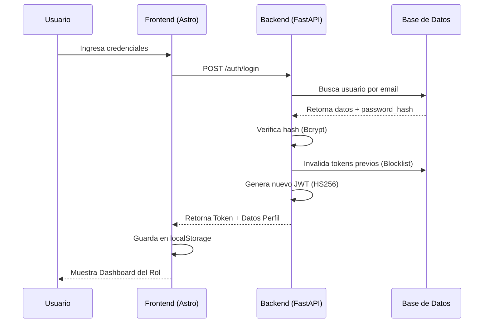
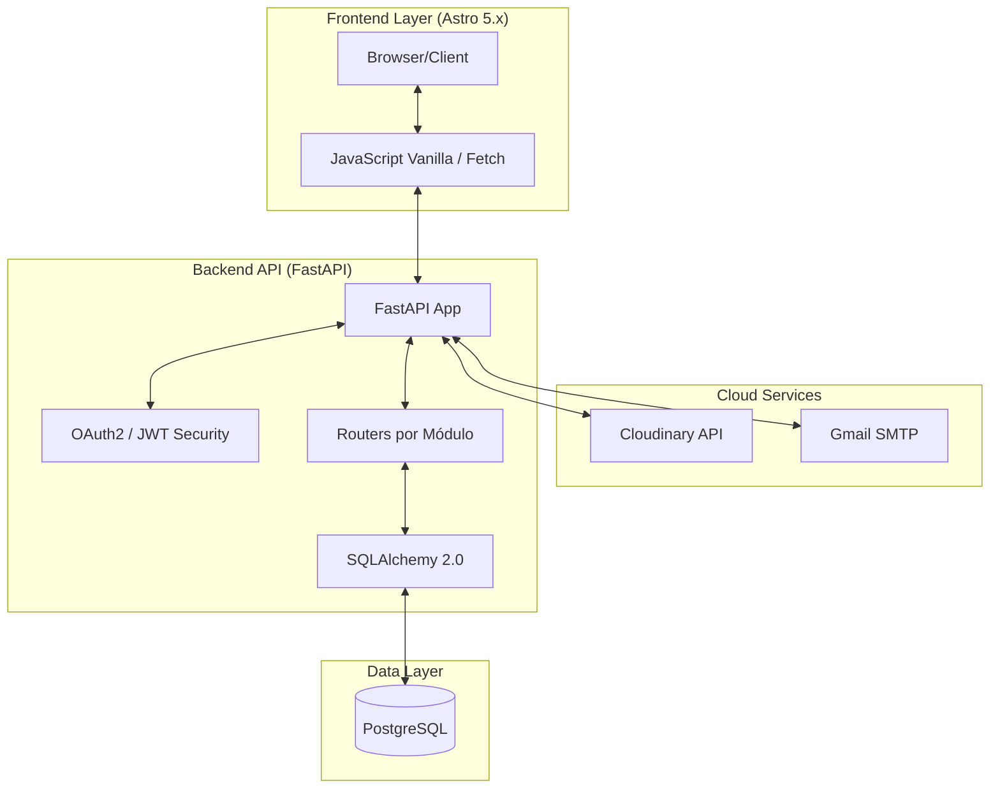
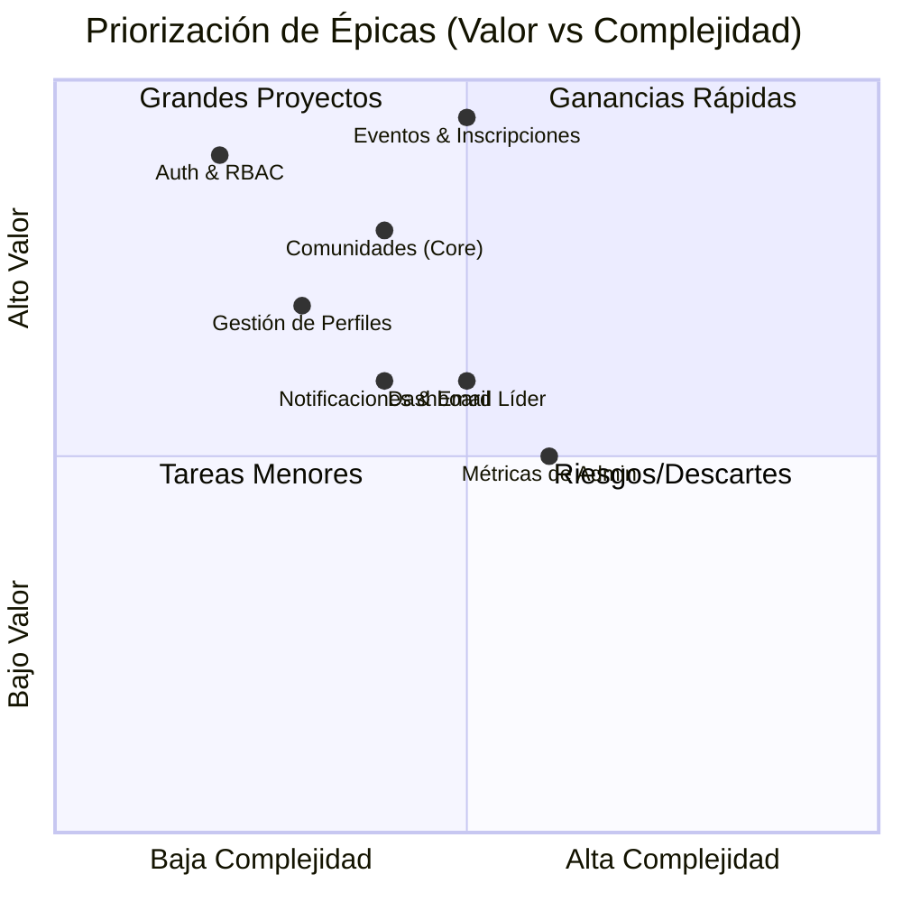
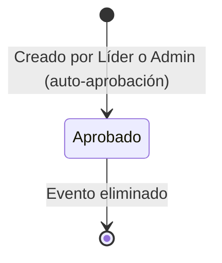

# Documentación de Requerimientos y Diseño - CTech

Este documento centraliza la especificación técnica, funcional y el diseño arquitectónico de la plataforma **CTech**.

---

## 1. Mapa de Actores y Roles

- **Visitante**: Acceso público a vitrina de eventos.
- **Usuario**: Miembro registrado de una comunidad — se inscribe a eventos.
- **Líder**: Modera y gestiona su comunidad (relación 1-a-1 con la comunidad).
- **Administrador**: Control global del sistema e infraestructura.

> El rol **Mentor** fue eliminado. CTech no gestiona mentorías ni cursos.

---

## 2. Diagrama de Casos de Uso

```mermaid
useCaseDiagram
    actor "Visitante" as V
    actor "Usuario" as U
    actor "Líder" as L
    actor "Administrador" as A

    package "Plataforma CTech" {
        usecase "Registrarse/Login" as UC1
        usecase "Unirse a Comunidad (Código)" as UC2
        usecase "Inscribirse a Evento" as UC3
        usecase "Crear/Gestionar Evento" as UC4
        usecase "Gestionar Usuarios y Roles" as UC5
        usecase "Ver Eventos Públicos" as UC6
    }

    V --> UC6
    V --> UC1
    U --> UC2
    U --> UC3
    L --> UC4
    A --> UC4
    A --> UC5
```

---

## 3. Requisitos Funcionales (RF)

| Número de Requisito | Nombre de Requisito | Tipo | Fuente de Requisito | Prioridad |
|---|---|---|---|---|
| RF 1 | Registro de Usuarios | Requisito Funcional | El sistema debe permitir el registro de nuevos usuarios con validación de email único y perfil activo por defecto. | Alta (debe implementarse para el lanzamiento inicial del sistema) |
| RF 2 | Autenticación JWT | Requisito Funcional | El sistema debe permitir el inicio de sesión seguro mediante tokens JWT con vigencia de 24 horas. | Alta (debe implementarse para el lanzamiento inicial del sistema) |
| RF 3 | Sesión Única | Requisito Funcional | El sistema debe invalidar los tokens previos al detectar un nuevo inicio de sesión del mismo usuario. | Alta (debe implementarse para el lanzamiento inicial del sistema) |
| RF 4 | Blocklist de Tokens | Requisito Funcional | El sistema debe permitir el cierre de sesión instantáneo invalidando el token activo en el servidor mediante una blocklist. | Alta (debe implementarse para el lanzamiento inicial del sistema) |
| RF 5 | Perfil de Usuario | Requisito Funcional | El sistema debe permitir a los usuarios actualizar sus datos personales y cambiar su contraseña. | Alta (debe implementarse para el lanzamiento inicial del sistema) |
| RF 6 | Control de Acceso Basado en Roles | Requisito Funcional | El sistema debe controlar el acceso a las funcionalidades mediante tres roles definidos: administrador, líder y usuario. | Alta (debe implementarse para el lanzamiento inicial del sistema) |
| RF 7 | Gestión de Comunidades | Requisito Funcional | El sistema debe permitir al administrador crear, editar y eliminar comunidades de forma global. | Alta (debe implementarse para el lanzamiento inicial del sistema) |
| RF 8 | Código de Acceso a Comunidad | Requisito Funcional | El sistema debe permitir a los usuarios unirse a comunidades mediante un código único compartido por el líder. | Alta (debe implementarse para el lanzamiento inicial del sistema) |
| RF 9 | Subida de Imágenes | Requisito Funcional | El sistema debe permitir la subida de logos e imágenes a Cloudinary para comunidades y eventos. | Media (puede implementarse en versiones posteriores al lanzamiento inicial) |
| RF 10 | Restricción de Líder Único | Requisito Funcional | El sistema debe garantizar que cada comunidad tenga un único líder asignado (relación 1:1). | Alta (debe implementarse para el lanzamiento inicial del sistema) |
| RF 11 | Creación de Eventos | Requisito Funcional | El sistema debe permitir a líderes y administradores crear eventos con aprobación automática. | Alta (debe implementarse para el lanzamiento inicial del sistema) |
| RF 12 | Flujo de Aprobación de Eventos | Requisito Funcional | El sistema debe publicar automáticamente los eventos creados por líderes y administradores, quedando disponibles de inmediato para los miembros. | Alta (debe implementarse para el lanzamiento inicial del sistema) |
| RF 13 | Visibilidad de Eventos | Requisito Funcional | El sistema debe permitir clasificar eventos como públicos (visibles sin registro) o privados (solo para miembros de la comunidad). | Alta (debe implementarse para el lanzamiento inicial del sistema) |
| RF 14 | Inscripción a Eventos | Requisito Funcional | El sistema debe permitir a los usuarios inscribirse en eventos aprobados, validando cupo disponible y registros duplicados. | Alta (debe implementarse para el lanzamiento inicial del sistema) |
| RF 15 | Control de Capacidad | Requisito Funcional | El sistema debe permitir configurar un límite de inscripciones por evento. | Alta (debe implementarse para el lanzamiento inicial del sistema) |
| RF 16 | Filtros por Modalidad | Requisito Funcional | El sistema debe permitir consultar y filtrar eventos por tipo: presencial o virtual. | Media (puede implementarse en versiones posteriores al lanzamiento inicial) |
| RF 17 | Notificaciones Segmentadas | Requisito Funcional | El sistema debe enviar alertas segmentadas por destinatario (`recipient_id`) para líderes y usuarios. | Media (puede implementarse en versiones posteriores al lanzamiento inicial) |
| RF 18 | Email de Confirmación | Requisito Funcional | El sistema debe enviar un correo electrónico automático al usuario al inscribirse en un evento. | Media (puede implementarse en versiones posteriores al lanzamiento inicial) |
| RF 19 | Dashboard del Administrador | Requisito Funcional | El sistema debe proporcionar al administrador un panel con métricas globales de usuarios, comunidades y eventos. | Media (puede implementarse en versiones posteriores al lanzamiento inicial) |
| RF 20 | Dashboard del Líder | Requisito Funcional | El sistema debe proporcionar al líder un panel con estadísticas de participación e inscripciones de su comunidad. | Media (puede implementarse en versiones posteriores al lanzamiento inicial) |
| RF 21 | Recuperación de Contraseña | Requisito Funcional | El sistema debe permitir la recuperación de contraseña mediante un token de seguridad enviado al correo del usuario. | Alta (debe implementarse para el lanzamiento inicial del sistema) |
| RF 22 | Gestión de Notificaciones | Requisito Funcional | El sistema debe permitir a los usuarios marcar notificaciones individuales o todas como leídas. | Baja (puede diferirse a versiones futuras sin impactar el lanzamiento) |
| RF 23 | Cancelación de Inscripción | Requisito Funcional | El sistema debe permitir al usuario cancelar su registro en un evento previamente inscrito. | Media (puede implementarse en versiones posteriores al lanzamiento inicial) |
| RF 24 | Conteo de Inscritos en Tiempo Real | Requisito Funcional | El sistema debe exponer el número actualizado de inscritos por evento (`registered_count`) en cada respuesta de la API. | Media (puede implementarse en versiones posteriores al lanzamiento inicial) |

---

## 4. Requisitos No Funcionales (RNF)

| Número de Requisito | Nombre de Requisito | Tipo | Fuente de Requisito | Prioridad |
|---|---|---|---|---|
| RNF 1 | Seguridad de Contraseñas | Requisito No Funcional | El sistema debe cifrar las contraseñas de los usuarios utilizando el algoritmo Bcrypt mediante la librería Passlib. | Alta (debe implementarse para el lanzamiento inicial del sistema) |
| RNF 2 | Escalabilidad | Requisito No Funcional | El sistema debe contar con una arquitectura modular y desacoplada en el backend que facilite su crecimiento y mantenimiento. | Media (puede implementarse en versiones posteriores al lanzamiento inicial) |
| RNF 3 | Rendimiento | Requisito No Funcional | El sistema debe utilizar Astro Islands en el frontend y subconsultas correlacionadas en el backend para evitar el problema de consultas N+1. | Alta (debe implementarse para el lanzamiento inicial del sistema) |
| RNF 4 | Disponibilidad e Integridad de Datos | Requisito No Funcional | El sistema debe utilizar PostgreSQL con integridad referencial activada para garantizar la consistencia de los datos. | Alta (debe implementarse para el lanzamiento inicial del sistema) |
| RNF 5 | Integración con Servicios Externos | Requisito No Funcional | El sistema debe integrarse con Cloudinary para gestión de imágenes y con Gmail SMTP para el envío de correos electrónicos. | Alta (debe implementarse para el lanzamiento inicial del sistema) |
| RNF 6 | Diseño Responsivo | Requisito No Funcional | El sistema debe implementar una interfaz de usuario responsiva y adaptable a distintos dispositivos utilizando Bootstrap 5. | Alta (debe implementarse para el lanzamiento inicial del sistema) |
| RNF 7 | Mantenibilidad y Documentación | Requisito No Funcional | El sistema debe generar documentación automática e interactiva de la API mediante Swagger, accesible en la ruta `/docs`. | Baja (puede diferirse a versiones futuras sin impactar el lanzamiento) |
| RNF 8 | Validación de Datos de Entrada | Requisito No Funcional | El sistema debe validar todos los datos de entrada utilizando Pydantic v2, con tipos `Literal` para campos de selección fija. | Alta (debe implementarse para el lanzamiento inicial del sistema) |

---

## 5. Flujo de Aprobación de Eventos

```mermaid
activityDiagram
    start
    :Líder o Admin crea evento;
    :Sistema lo marca como 'Approved' (Auto-Aprobación);
    :Guardar en Base de Datos;
    fork
        :Notificar a todos los Usuarios (si es Público);
    orchestrate
        :Notificar a miembros de la Comunidad (si es Privado);
    end fork
    stop
```

---

## 6. Flujo de Login y Sesión



---

## 7. Arquitectura Tecnológica



---

## 8. Priorización de Épicas



---

## 9. Diagrama de Estados — Evento



---

## 10. Catálogo de Casos de Uso

### 10.1 Gestión de Identidad y Acceso
- **CU-AC-01**: Registro con validación de email único.
- **CU-AC-02**: Login con invalidación de sesiones previas.
- **CU-AC-03**: Reset de contraseña vía token por email.
- **CU-AC-04**: Edición de perfil (nombre, bio, avatar, redes).
- **CU-AC-05**: Logout con destrucción del token en servidor (blocklist).
- **CU-AC-06**: Eliminación de cuenta propia.

### 10.2 Usuario Estándar
- **CU-US-01**: Unirse a comunidad con código del líder.
- **CU-US-02**: Ver listado de eventos (públicos sin auth, aprobados con auth según comunidad y rol).
- **CU-US-03**: Inscribirse a un evento (validación de cupo y duplicados).
- **CU-US-04**: Cancelar inscripción a un evento.
- **CU-US-05**: Recibir notificaciones in-app y correo de confirmación.
- **CU-US-06**: Ver directorio de miembros de su comunidad.

### 10.3 Líder de Comunidad
- **CU-LD-01**: Crear eventos (auto-aprobados).
- **CU-LD-02**: Ver y gestionar los eventos de su comunidad.
- **CU-LD-03**: Ver lista de inscritos por evento.
- **CU-LD-04**: Actualizar logo y descripción de su comunidad.
- **CU-LD-05**: Dashboard con estadísticas de miembros y eventos.
- **CU-LD-06**: Ver y gestionar miembros de su comunidad.

### 10.4 Administrador
- **CU-AD-01**: CRUD global de comunidades (crear, editar, eliminar).
- **CU-AD-02**: CRUD total de usuarios y cambio de roles.
- **CU-AD-03**: Crear, editar y eliminar cualquier evento del sistema.
- **CU-AD-04**: Dashboard global con métricas de toda la plataforma.
- **CU-AD-05**: Crear y asignar líderes a comunidades.
