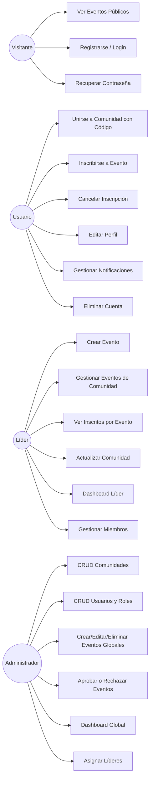
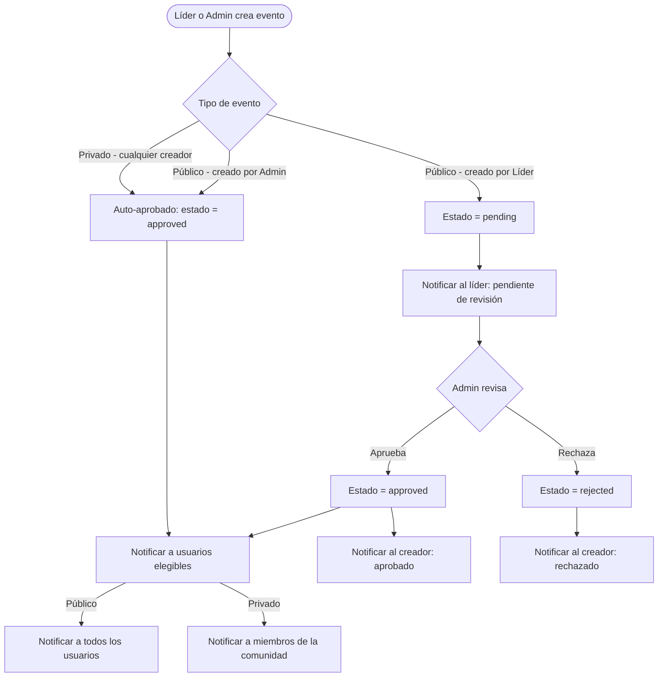
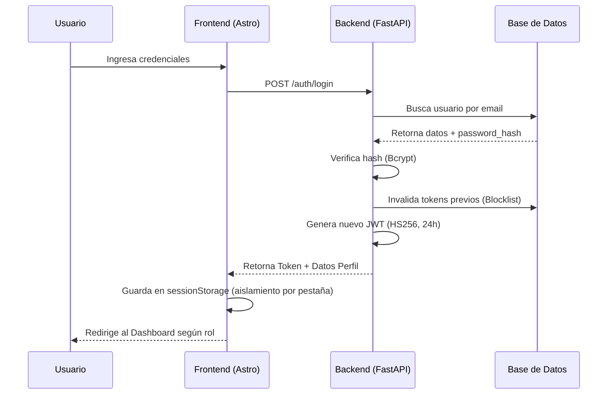
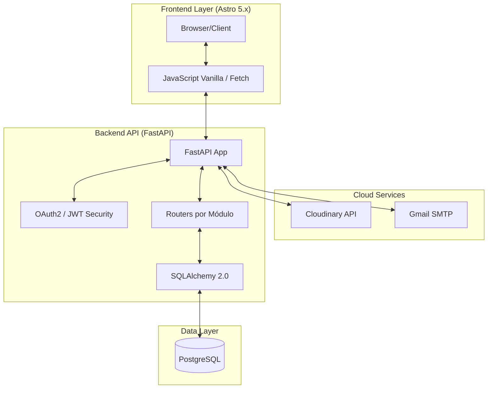
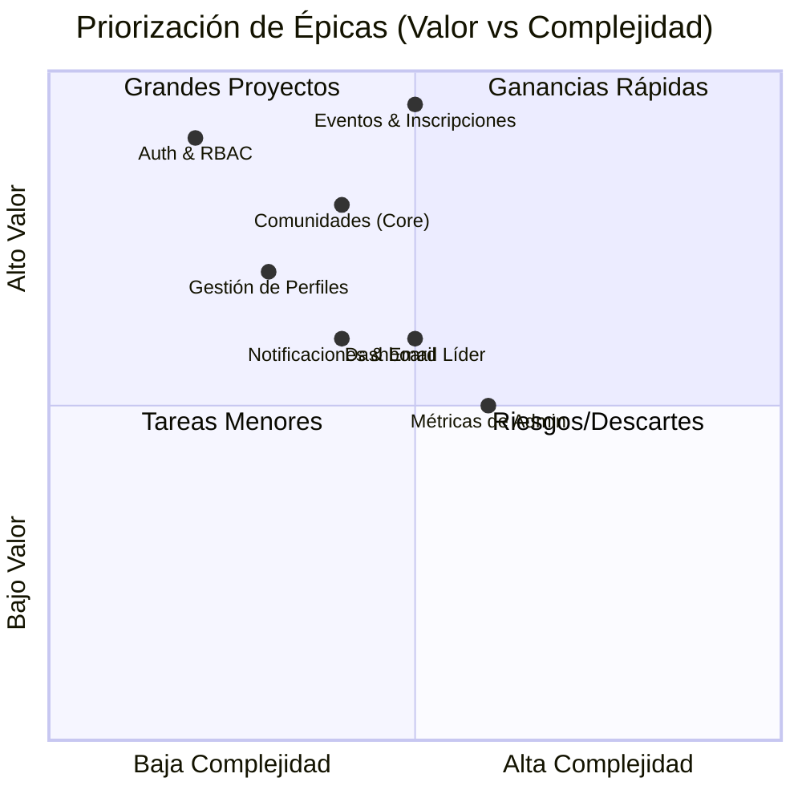
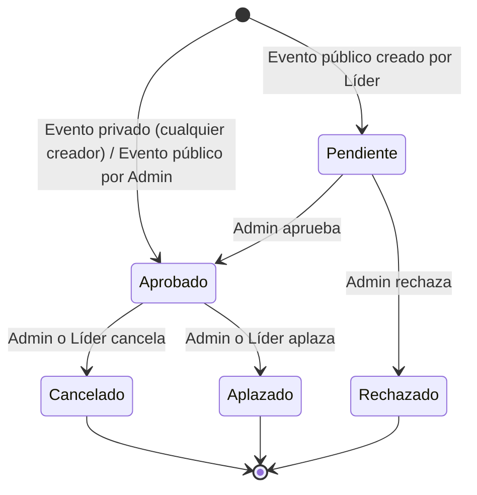
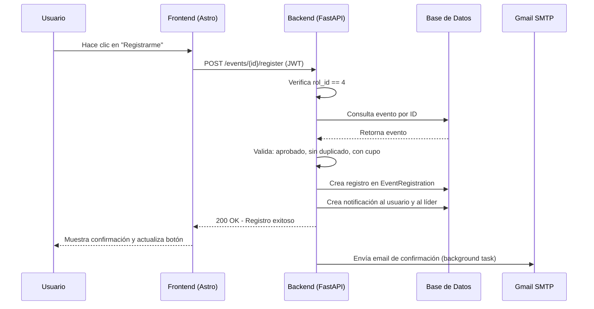

# Documentación de Requerimientos y Diseño - CTech

Este documento centraliza la especificación técnica, funcional y el diseño arquitectónico de la plataforma **CTech**.

---

## 1. Mapa de Actores y Roles

- **Visitante**: Acceso público a vitrina de eventos.
- **Usuario**: Miembro registrado de una comunidad — se inscribe a eventos.
- **Líder**: Modera y gestiona su comunidad (relación 1-a-1 con la comunidad).
- **Administrador**: Control global del sistema e infraestructura.

> El rol **Mentor** fue eliminado. CTech no gestiona mentorías ni cursos.

---

## 2. Diagrama de Casos de Uso

---

## 3. Requisitos Funcionales (RF)

| Número de Requisito | Nombre de Requisito | Tipo | Fuente de Requisito | Prioridad |
|---|---|---|---|---|
| RF 1 | Registro de Usuarios | Requisito Funcional | El sistema debe permitir el registro de nuevos usuarios con validación de email único y perfil activo por defecto. | Alta (debe implementarse para el lanzamiento inicial del sistema) |
| RF 2 | Autenticación JWT | Requisito Funcional | El sistema debe permitir el inicio de sesión seguro mediante tokens JWT con vigencia de 24 horas. | Alta (debe implementarse para el lanzamiento inicial del sistema) |
| RF 3 | Sesión Única | Requisito Funcional | El sistema debe invalidar los tokens previos al detectar un nuevo inicio de sesión del mismo usuario. | Alta (debe implementarse para el lanzamiento inicial del sistema) |
| RF 4 | Blocklist de Tokens | Requisito Funcional | El sistema debe permitir el cierre de sesión instantáneo invalidando el token activo en el servidor mediante una blocklist. | Alta (debe implementarse para el lanzamiento inicial del sistema) |
| RF 5 | Perfil de Usuario | Requisito Funcional | El sistema debe permitir a los usuarios actualizar sus datos personales y cambiar su contraseña. | Alta (debe implementarse para el lanzamiento inicial del sistema) |
| RF 6 | Control de Acceso Basado en Roles | Requisito Funcional | El sistema debe controlar el acceso a las funcionalidades mediante tres roles definidos: administrador, líder y usuario. | Alta (debe implementarse para el lanzamiento inicial del sistema) |
| RF 7 | Gestión de Comunidades | Requisito Funcional | El sistema debe permitir al administrador crear, editar y eliminar comunidades de forma global. | Alta (debe implementarse para el lanzamiento inicial del sistema) |
| RF 8 | Código de Acceso a Comunidad | Requisito Funcional | El sistema debe permitir a los usuarios unirse a comunidades mediante un código único compartido por el líder. | Alta (debe implementarse para el lanzamiento inicial del sistema) |
| RF 9 | Subida de Imágenes | Requisito Funcional | El sistema debe permitir la subida de logos e imágenes a Cloudinary para comunidades y eventos. | Media (puede implementarse en versiones posteriores al lanzamiento inicial) |
| RF 10 | Restricción de Líder Único | Requisito Funcional | El sistema debe garantizar que cada comunidad tenga un único líder asignado (relación 1:1). | Alta (debe implementarse para el lanzamiento inicial del sistema) |
| RF 11 | Creación de Eventos | Requisito Funcional | El sistema debe permitir a líderes y administradores crear eventos con aprobación automática. | Alta (debe implementarse para el lanzamiento inicial del sistema) |
| RF 12 | Flujo de Aprobación de Eventos | Requisito Funcional | El sistema debe publicar automáticamente los eventos privados y los eventos públicos creados por el admin; los eventos públicos creados por líderes quedan pendientes de aprobación del administrador. | Alta (debe implementarse para el lanzamiento inicial del sistema) |
| RF 13 | Visibilidad de Eventos | Requisito Funcional | El sistema debe permitir clasificar eventos como públicos (visibles sin registro) o privados (solo para miembros de la comunidad). | Alta (debe implementarse para el lanzamiento inicial del sistema) |
| RF 14 | Inscripción a Eventos | Requisito Funcional | El sistema debe permitir únicamente a los usuarios con rol estándar (rol_id=4) inscribirse en eventos aprobados, validando cupo disponible y registros duplicados. | Alta (debe implementarse para el lanzamiento inicial del sistema) |
| RF 15 | Control de Capacidad | Requisito Funcional | El sistema debe permitir configurar un límite de inscripciones por evento. | Alta (debe implementarse para el lanzamiento inicial del sistema) |
| RF 16 | Filtros por Modalidad | Requisito Funcional | El sistema debe permitir consultar y filtrar eventos por tipo: presencial o virtual. | Media (puede implementarse en versiones posteriores al lanzamiento inicial) |
| RF 17 | Notificaciones Segmentadas | Requisito Funcional | El sistema debe enviar alertas segmentadas por destinatario (`recipient_id`) para líderes y usuarios. | Media (puede implementarse en versiones posteriores al lanzamiento inicial) |
| RF 18 | Email de Confirmación | Requisito Funcional | El sistema debe enviar un correo electrónico automático al usuario al inscribirse en un evento. | Media (puede implementarse en versiones posteriores al lanzamiento inicial) |
| RF 19 | Dashboard del Administrador | Requisito Funcional | El sistema debe proporcionar al administrador un panel con métricas globales de usuarios, comunidades y eventos. | Media (puede implementarse en versiones posteriores al lanzamiento inicial) |
| RF 20 | Dashboard del Líder | Requisito Funcional | El sistema debe proporcionar al líder un panel con estadísticas de participación e inscripciones de su comunidad. | Media (puede implementarse en versiones posteriores al lanzamiento inicial) |
| RF 21 | Recuperación de Contraseña | Requisito Funcional | El sistema debe permitir la recuperación de contraseña mediante un token de seguridad enviado al correo del usuario con expiración de 1 hora. | Alta (debe implementarse para el lanzamiento inicial del sistema) |
| RF 22 | Gestión de Notificaciones | Requisito Funcional | El sistema debe permitir a los usuarios marcar notificaciones individuales o todas como leídas. | Baja (puede diferirse a versiones futuras sin impactar el lanzamiento) |
| RF 23 | Cancelación de Inscripción | Requisito Funcional | El sistema debe permitir al usuario cancelar su registro en un evento previamente inscrito. | Media (puede implementarse en versiones posteriores al lanzamiento inicial) |
| RF 24 | Conteo de Inscritos en Tiempo Real | Requisito Funcional | El sistema debe exponer el número actualizado de inscritos por evento (`registered_count`) en cada respuesta de la API. | Media (puede implementarse en versiones posteriores al lanzamiento inicial) |
| RF 25 | Eventos Globales del Administrador | Requisito Funcional | El sistema debe permitir al administrador crear eventos sin comunidad asignada (globales), visibles para todos los usuarios y líderes del sistema. Solo el administrador puede editarlos y eliminarlos. | Alta (debe implementarse para el lanzamiento inicial del sistema) |
| RF 26 | Notificaciones por Cambio de Estado de Evento | Requisito Funcional | El sistema debe enviar correos electrónicos a todos los inscritos de un evento cuando éste sea cancelado o aplazado. | Media (puede implementarse en versiones posteriores al lanzamiento inicial) |

---

## 4. Requisitos No Funcionales (RNF)

| Número de Requisito | Nombre de Requisito | Tipo | Fuente de Requisito | Prioridad |
|---|---|---|---|---|
| RNF 1 | Seguridad de Contraseñas | Requisito No Funcional | El sistema debe cifrar las contraseñas de los usuarios utilizando el algoritmo Bcrypt mediante la librería Passlib. | Alta (debe implementarse para el lanzamiento inicial del sistema) |
| RNF 2 | Escalabilidad | Requisito No Funcional | El sistema debe contar con una arquitectura modular y desacoplada en el backend que facilite su crecimiento y mantenimiento. | Media (puede implementarse en versiones posteriores al lanzamiento inicial) |
| RNF 3 | Rendimiento | Requisito No Funcional | El sistema debe utilizar Astro Islands en el frontend y subconsultas correlacionadas en el backend para evitar el problema de consultas N+1. | Alta (debe implementarse para el lanzamiento inicial del sistema) |
| RNF 4 | Disponibilidad e Integridad de Datos | Requisito No Funcional | El sistema debe utilizar PostgreSQL con integridad referencial activada para garantizar la consistencia de los datos. | Alta (debe implementarse para el lanzamiento inicial del sistema) |
| RNF 5 | Integración con Servicios Externos | Requisito No Funcional | El sistema debe integrarse con Cloudinary para gestión de imágenes y con Gmail SMTP para el envío de correos electrónicos. | Alta (debe implementarse para el lanzamiento inicial del sistema) |
| RNF 6 | Diseño Responsivo | Requisito No Funcional | El sistema debe implementar una interfaz de usuario responsiva y adaptable a distintos dispositivos utilizando Bootstrap 5. | Alta (debe implementarse para el lanzamiento inicial del sistema) |
| RNF 7 | Mantenibilidad y Documentación | Requisito No Funcional | El sistema debe generar documentación automática e interactiva de la API mediante Swagger, accesible en la ruta `/docs`. | Baja (puede diferirse a versiones futuras sin impactar el lanzamiento) |
| RNF 8 | Validación de Datos de Entrada | Requisito No Funcional | El sistema debe validar todos los datos de entrada utilizando Pydantic v2, con tipos `Literal` para campos de selección fija. | Alta (debe implementarse para el lanzamiento inicial del sistema) |
| RNF 9 | Aislamiento de Sesión por Pestaña | Requisito No Funcional | El sistema debe almacenar el token JWT en `sessionStorage` del navegador para garantizar aislamiento de sesión por pestaña. | Alta (debe implementarse para el lanzamiento inicial del sistema) |

---

## 5. Flujo de Aprobación de Eventos

---

## 6. Flujo de Login y Sesión

---

## 7. Arquitectura Tecnológica

---

## 8. Priorización de Épicas

---

## 9. Diagrama de Estados — Evento

---

## 10. Diagrama de Secuencia — Inscripción a Evento

---

## 11. Catálogo de Casos de Uso

---

### 11.1 Gestión de Identidad y Acceso

---

#### CU-AC-01 — Registro de Usuario

| Campo | Detalle |
|-------|---------|
| **Código RF** | RF1, RF8 |
| **Caso de Uso** | CU-AC-01 — Registro de Usuario |
| **Descripción** | Un visitante crea una cuenta en CTech proporcionando sus datos personales y el código de acceso de una comunidad. El sistema valida los datos, crea el perfil y envía un correo de bienvenida. |
| **Actores** | Visitante, Sistema |
| **Precondiciones** | El visitante no tiene cuenta registrada. Existe al menos una comunidad activa con código válido. |

**Secuencia:**

| Paso | Actor | Acción | Resultado |
|------|-------|--------|-----------|
| 1 | Visitante | Accede al formulario de registro | Sistema muestra formulario con campos: nombre, email, contraseña, comunidad y código de invitación |
| 2 | Visitante | Selecciona una comunidad del listado | Sistema muestra las comunidades disponibles cargadas desde `GET /communities/public` |
| 3 | Visitante | Completa todos los campos y hace clic en "Registrarse" | Sistema envía `POST /auth/register` con los datos |
| 4 | Sistema | Valida formato de nombre (solo letras y espacios) | Si inválido: retorna 400 con mensaje de error |
| 5 | Sistema | Valida email único en la base de datos | Si duplicado: retorna 400 "Email ya registrado" |
| 6 | Sistema | Valida código de invitación contra `community.code` | Si no coincide: retorna 400 "Código de invitación inválido" |
| 7 | Sistema | Valida complejidad de contraseña (5-13 chars, mayúscula, minúscula, número, especial) | Si no cumple: retorna 400 con requisitos de contraseña |
| 8 | Sistema | Crea usuario con `rol_id=4`, crea perfil vacío, asocia a la comunidad | Retorna 201 con mensaje de éxito |
| 9 | Sistema | Envía correo de bienvenida (background task) | Usuario recibe email "¡Bienvenido a CTech!" |
| 10 | Sistema | Notifica al líder de la comunidad | Líder recibe notificación in-app "Nuevo Miembro" |
| 11 | Visitante | Redirigido al login | Sistema muestra pantalla de inicio de sesión |

**Postcondiciones:** Usuario creado con `rol_id=4`, perfil vacío vinculado, miembro de la comunidad seleccionada.

**Excepciones:**
- Email ya registrado → Error 400
- Código de comunidad inválido → Error 400
- Comunidad no existe → Error 404
- Contraseña no cumple complejidad → Error 400

---

#### CU-AC-02 — Inicio de Sesión

| Campo | Detalle |
|-------|---------|
| **Código RF** | RF2, RF3, RF4 |
| **Caso de Uso** | CU-AC-02 — Inicio de Sesión |
| **Descripción** | Un usuario registrado inicia sesión con sus credenciales. El sistema valida la contraseña, invalida tokens previos, genera un nuevo JWT y redirige al panel según el rol. |
| **Actores** | Usuario / Líder / Administrador, Sistema |
| **Precondiciones** | El usuario tiene cuenta activa. |

**Secuencia:**

| Paso | Actor | Acción | Resultado |
|------|-------|--------|-----------|
| 1 | Usuario | Accede a la página de login | Sistema muestra formulario de email y contraseña |
| 2 | Usuario | Ingresa email y contraseña, hace clic en "Entrar" | Sistema envía `POST /auth/login` |
| 3 | Sistema | Busca usuario por email en la base de datos | Si no existe: retorna 401 "Credenciales inválidas" |
| 4 | Sistema | Verifica contraseña con Bcrypt | Si no coincide: retorna 401 "Credenciales inválidas" |
| 5 | Sistema | Invalida tokens previos del usuario (blocklist) | Sesiones anteriores quedan inactivas |
| 6 | Sistema | Genera nuevo JWT firmado HS256 con expiración 24h | Token generado |
| 7 | Sistema | Retorna token + datos del usuario (id, email, rol, comunidad) | Frontend recibe respuesta 200 |
| 8 | Frontend | Guarda token en `sessionStorage` | Token disponible solo en esa pestaña |
| 9 | Frontend | Redirige según `rol_id`: 1→admin, 3→líder, 4→usuario | Usuario ve su panel correspondiente |

**Postcondiciones:** Token activo almacenado en sessionStorage. Tokens previos invalidados.

**Excepciones:**
- Email no existe → Error 401
- Contraseña incorrecta → Error 401
- Usuario sin rol reconocido → Error 403

---

#### CU-AC-03 — Recuperación de Contraseña

| Campo | Detalle |
|-------|---------|
| **Código RF** | RF21 |
| **Caso de Uso** | CU-AC-03 — Recuperación de Contraseña |
| **Descripción** | Un usuario que olvidó su contraseña solicita un enlace de recuperación. El sistema genera un token seguro, lo envía por correo y permite al usuario establecer una nueva contraseña. |
| **Actores** | Visitante, Sistema, Gmail SMTP |
| **Precondiciones** | El usuario tiene una cuenta registrada con email válido. |

**Secuencia:**

| Paso | Actor | Acción | Resultado |
|------|-------|--------|-----------|
| 1 | Visitante | Hace clic en "¿Olvidaste tu contraseña?" | Sistema muestra formulario para ingresar el email |
| 2 | Visitante | Ingresa su email y confirma | Sistema envía `POST /auth/forgot-password` |
| 3 | Sistema | Busca el usuario por email | Siempre retorna 200 (seguridad: no revela si el email existe) |
| 4 | Sistema | Si el email existe: genera token `urlsafe` de 32 bytes con expiración 1 hora | Token almacenado en `user.reset_token` y `reset_token_expires` |
| 5 | Sistema | Envía correo con enlace de recuperación (background task) | Usuario recibe email con enlace válido por 1 hora |
| 6 | Visitante | Hace clic en el enlace del correo | Sistema muestra formulario de nueva contraseña |
| 7 | Visitante | Ingresa nueva contraseña y confirma | Sistema envía `PATCH /auth/reset-password` |
| 8 | Sistema | Valida token no expirado y coincidencia de email | Si inválido: retorna 400 "Token inválido o expirado" |
| 9 | Sistema | Valida complejidad de la nueva contraseña | Si no cumple: retorna 400 con requisitos |
| 10 | Sistema | Actualiza `password_hash`, limpia el token | Retorna 200 "Contraseña actualizada correctamente" |

**Postcondiciones:** Contraseña actualizada. Token de recuperación eliminado de la base de datos.

**Excepciones:**
- Token expirado (>1 hora) → Error 400
- Token no coincide con el email → Error 400
- Nueva contraseña no cumple complejidad → Error 400

---

#### CU-AC-04 — Edición de Perfil

| Campo | Detalle |
|-------|---------|
| **Código RF** | RF5 |
| **Caso de Uso** | CU-AC-04 — Edición de Perfil |
| **Descripción** | Un usuario autenticado actualiza sus datos personales (nombre, email) o su contraseña. El sistema valida los cambios y envía notificación por correo si el email o nombre cambian. |
| **Actores** | Usuario / Líder / Administrador, Sistema |
| **Precondiciones** | El usuario está autenticado. |

**Secuencia:**

| Paso | Actor | Acción | Resultado |
|------|-------|--------|-----------|
| 1 | Usuario | Accede a la sección de ajustes de perfil | Sistema muestra formulario con datos actuales |
| 2 | Usuario | Modifica nombre o email y guarda | Sistema envía `PATCH /users/me` |
| 3 | Sistema | Valida que el nuevo email no esté en uso | Si duplicado: retorna 400 |
| 4 | Sistema | Actualiza los datos en la base de datos | Retorna 200 con datos actualizados |
| 5 | Sistema | Si cambió nombre o email: envía correo de confirmación (background task) | Usuario recibe notificación de cambio |
| 6 | Usuario | Para cambiar contraseña: ingresa contraseña actual y nueva | Sistema envía `PATCH /users/me/password` |
| 7 | Sistema | Verifica que la contraseña actual sea correcta | Si no coincide: retorna 400 |
| 8 | Sistema | Valida complejidad de nueva contraseña | Si no cumple: retorna 400 |
| 9 | Sistema | Actualiza `password_hash` y envía correo de confirmación | Retorna 200 |

**Postcondiciones:** Datos del perfil actualizados en la base de datos.

**Excepciones:**
- Nuevo email ya en uso → Error 400
- Contraseña actual incorrecta → Error 400
- Nueva contraseña no cumple complejidad → Error 400

---

#### CU-AC-05 — Cierre de Sesión

| Campo | Detalle |
|-------|---------|
| **Código RF** | RF4 |
| **Caso de Uso** | CU-AC-05 — Cierre de Sesión |
| **Descripción** | El usuario finaliza su sesión activa. El sistema invalida el token en el servidor y elimina los datos del sessionStorage. |
| **Actores** | Usuario / Líder / Administrador, Sistema |
| **Precondiciones** | El usuario está autenticado con token activo. |

**Secuencia:**

| Paso | Actor | Acción | Resultado |
|------|-------|--------|-----------|
| 1 | Usuario | Hace clic en "Cerrar sesión" | Frontend envía `POST /auth/logout` con el token en cabecera |
| 2 | Sistema | Agrega el token a la `TokenBlocklist` | Token inválido para futuras peticiones |
| 3 | Sistema | Retorna 200 "Sesión cerrada exitosamente" | Frontend recibe confirmación |
| 4 | Frontend | Elimina token de `sessionStorage` | Sesión limpia en el navegador |
| 5 | Frontend | Redirige al usuario a la página de login | Usuario ve pantalla de inicio |

**Postcondiciones:** Token en blocklist. sessionStorage limpio. Usuario no puede reutilizar el token.

**Excepciones:**
- Token ya en blocklist (doble logout) → Error 401

---

#### CU-AC-06 — Eliminación de Cuenta

| Campo | Detalle |
|-------|---------|
| **Código RF** | RF5 |
| **Caso de Uso** | CU-AC-06 — Eliminación de Cuenta Propia |
| **Descripción** | Un usuario elimina su propia cuenta del sistema. Esta acción es irreversible. Los administradores no pueden eliminar su propia cuenta. |
| **Actores** | Usuario / Líder, Sistema |
| **Precondiciones** | El usuario está autenticado. El usuario no tiene rol de administrador. |

**Secuencia:**

| Paso | Actor | Acción | Resultado |
|------|-------|--------|-----------|
| 1 | Usuario | Accede a ajustes y hace clic en "Eliminar cuenta" | Sistema muestra confirmación con advertencia |
| 2 | Usuario | Confirma la eliminación | Frontend envía `DELETE /users/me` |
| 3 | Sistema | Verifica que el usuario no sea admin (rol_id ≠ 1) | Si es admin: retorna 403 |
| 4 | Sistema | Elimina el usuario y todos sus datos asociados | Retorna 200 "Cuenta eliminada correctamente" |
| 5 | Frontend | Limpia sessionStorage y redirige al login | Usuario ve pantalla de inicio |

**Postcondiciones:** Usuario eliminado de la base de datos. Sesión terminada.

**Excepciones:**
- Usuario es administrador → Error 403 (los admins no pueden autoeliminarse)

---

### 11.2 Usuario Estándar

---

#### CU-US-01 — Unirse a una Comunidad con Código

| Campo | Detalle |
|-------|---------|
| **Código RF** | RF8 |
| **Caso de Uso** | CU-US-01 — Unirse a Comunidad con Código de Invitación |
| **Descripción** | Un visitante se registra en CTech usando el código único de una comunidad, con lo cual queda automáticamente vinculado a ella como miembro. |
| **Actores** | Visitante, Sistema |
| **Precondiciones** | El visitante tiene el código de invitación de la comunidad. La comunidad existe y está activa. |

**Secuencia:**

| Paso | Actor | Acción | Resultado |
|------|-------|--------|-----------|
| 1 | Visitante | Accede al formulario de registro | Sistema muestra listado de comunidades y campo de código |
| 2 | Visitante | Selecciona la comunidad e ingresa el código | Sistema valida en tiempo real |
| 3 | Sistema | Compara el código ingresado con `community.code` en BD | Si no coincide: error de validación |
| 4 | Sistema | Vincula `user.community_id` a la comunidad seleccionada al crear la cuenta | Usuario queda como miembro |
| 5 | Sistema | Notifica al líder de la comunidad | Líder recibe: "Nuevo Miembro: [nombre] se unió" |

**Postcondiciones:** Usuario vinculado a la comunidad. Líder notificado.

**Excepciones:**
- Código incorrecto → Error 400 "Código de invitación inválido"
- Comunidad no existe → Error 404

---

#### CU-US-02 — Ver Listado de Eventos

| Campo | Detalle |
|-------|---------|
| **Código RF** | RF13, RF16, RF25 |
| **Caso de Uso** | CU-US-02 — Ver Listado de Eventos |
| **Descripción** | El usuario autenticado visualiza los eventos aprobados de su comunidad y los eventos globales del administrador. Puede filtrar por modalidad. |
| **Actores** | Usuario, Sistema |
| **Precondiciones** | El usuario está autenticado y pertenece a una comunidad. |

**Secuencia:**

| Paso | Actor | Acción | Resultado |
|------|-------|--------|-----------|
| 1 | Usuario | Accede al panel de eventos | Frontend consulta `GET /events/?upcoming_only=true` |
| 2 | Sistema | Retorna eventos aprobados accesibles para el usuario | Lista de eventos de su comunidad + eventos globales del admin (community_id = null) |
| 3 | Frontend | Filtra eventos: solo los de su comunidad y los globales | Excluye eventos de otras comunidades |
| 4 | Usuario | Aplica filtro "Virtual" o "Presencial" | Frontend filtra localmente la lista |
| 5 | Usuario | Hace clic en un evento | Sistema muestra modal con información detallada: título, descripción, fecha, hora, lugar, cupo, organizador |
| 6 | Sistema | Indica si el usuario ya está inscrito (`is_registered`) | Botón muestra "Registrarme" o "Cancelar Registro" |

**Postcondiciones:** Usuario puede ver y filtrar eventos según su comunidad.

**Excepciones:**
- Sin comunidad asignada: solo ve eventos globales del admin

---

#### CU-US-03 — Inscribirse a un Evento

| Campo | Detalle |
|-------|---------|
| **Código RF** | RF14, RF15, RF17, RF18 |
| **Caso de Uso** | CU-US-03 — Inscribirse a un Evento |
| **Descripción** | El usuario se inscribe en un evento aprobado. El sistema valida el cupo, la ausencia de duplicados y el rol del usuario. Envía confirmación por correo y notifica al líder. |
| **Actores** | Usuario, Sistema, Gmail SMTP |
| **Precondiciones** | El usuario está autenticado con `rol_id=4`. El evento existe, está aprobado y tiene cupo disponible. El usuario no está ya inscrito. |

**Secuencia:**

| Paso | Actor | Acción | Resultado |
|------|-------|--------|-----------|
| 1 | Usuario | Hace clic en "Registrarme" en la card o modal del evento | Frontend envía `POST /events/{id}/register` |
| 2 | Sistema | Verifica que `rol_id == 4` | Si admin o líder: retorna 403 "Solo los usuarios pueden registrarse" |
| 3 | Sistema | Verifica que el evento existe y está `approved` | Si no: retorna 400 |
| 4 | Sistema | Verifica que el usuario no esté ya inscrito | Si duplicado: retorna 409 "Ya estás registrado" |
| 5 | Sistema | Verifica que haya cupo disponible (si `capacity` está definido) | Si lleno: retorna 400 "Sin cupos disponibles" |
| 6 | Sistema | Crea registro en `EventRegistration` | Retorna 200 "Registro exitoso" |
| 7 | Frontend | Actualiza botón a "Cancelar Registro" | Interfaz refleja el estado inscrito |
| 8 | Sistema | Envía correo de confirmación al usuario (background task) | Usuario recibe email con detalles del evento |
| 9 | Sistema | Notifica al líder: nueva inscripción con conteo total | Líder ve notificación in-app |
| 10 | Sistema | Notifica al usuario in-app: "¡Inscripción Exitosa!" | Usuario ve notificación en el panel |

**Postcondiciones:** Usuario inscrito en el evento. Registro almacenado. Correo enviado.

**Excepciones:**
- Usuario es admin o líder → Error 403
- Evento no está aprobado → Error 400
- Usuario ya inscrito → Error 409
- Sin cupo disponible → Error 400

---

#### CU-US-04 — Cancelar Inscripción a un Evento

| Campo | Detalle |
|-------|---------|
| **Código RF** | RF23 |
| **Caso de Uso** | CU-US-04 — Cancelar Inscripción |
| **Descripción** | El usuario cancela su registro en un evento en el que ya está inscrito. |
| **Actores** | Usuario, Sistema |
| **Precondiciones** | El usuario está autenticado e inscrito en el evento. |

**Secuencia:**

| Paso | Actor | Acción | Resultado |
|------|-------|--------|-----------|
| 1 | Usuario | Hace clic en "Cancelar Registro" | Frontend envía `DELETE /events/{id}/register` |
| 2 | Sistema | Verifica que el usuario esté inscrito | Si no está inscrito: retorna 404 "No estás registrado" |
| 3 | Sistema | Elimina el registro de `EventRegistration` | Retorna 200 "Registro cancelado correctamente" |
| 4 | Frontend | Actualiza botón a "Registrarme" | Interfaz refleja que el usuario ya no está inscrito |

**Postcondiciones:** Registro eliminado. Cupo liberado.

**Excepciones:**
- Usuario no está inscrito → Error 404

---

#### CU-US-05 — Gestionar Notificaciones

| Campo | Detalle |
|-------|---------|
| **Código RF** | RF17, RF22 |
| **Caso de Uso** | CU-US-05 — Gestionar Notificaciones |
| **Descripción** | El usuario visualiza sus notificaciones in-app y puede marcarlas como leídas individualmente o todas a la vez. |
| **Actores** | Usuario, Sistema |
| **Precondiciones** | El usuario está autenticado. |

**Secuencia:**

| Paso | Actor | Acción | Resultado |
|------|-------|--------|-----------|
| 1 | Usuario | Accede al panel de notificaciones | Frontend consulta `GET /notifications/` |
| 2 | Sistema | Retorna notificaciones dirigidas al usuario (`recipient_id`) | Lista ordenada por fecha, con estado `is_read` |
| 3 | Usuario | Hace clic en "Marcar como leída" en una notificación | Frontend envía `PATCH /notifications/{id}/read` |
| 4 | Sistema | Actualiza `is_read = true` para esa notificación | Retorna notificación actualizada |
| 5 | Usuario | Hace clic en "Marcar todas como leídas" | Frontend envía `POST /notifications/read-all` |
| 6 | Sistema | Actualiza todas las notificaciones del usuario a `is_read = true` | Retorna confirmación |

**Postcondiciones:** Notificaciones marcadas como leídas. Contador de notificaciones se actualiza.

**Excepciones:**
- Notificación no pertenece al usuario → Error 403

---

#### CU-US-06 — Ver Directorio de Miembros

| Campo | Detalle |
|-------|---------|
| **Código RF** | RF6, RF7 |
| **Caso de Uso** | CU-US-06 — Ver Directorio de Miembros |
| **Descripción** | El usuario visualiza los miembros de su comunidad. |
| **Actores** | Usuario, Sistema |
| **Precondiciones** | El usuario está autenticado y pertenece a una comunidad. |

**Secuencia:**

| Paso | Actor | Acción | Resultado |
|------|-------|--------|-----------|
| 1 | Usuario | Accede a la sección de miembros | Frontend consulta `GET /users/community/{community_id}` |
| 2 | Sistema | Retorna lista de usuarios de la comunidad | Lista con nombre, email y foto de perfil |
| 3 | Usuario | Navega por el listado de miembros | Ve información básica de cada miembro |

**Postcondiciones:** Usuario puede ver el directorio de su comunidad.

**Excepciones:**
- Sin comunidad asignada → Lista vacía o acceso denegado

---

### 11.3 Líder de Comunidad

---

#### CU-LD-01 — Crear Evento

| Campo | Detalle |
|-------|---------|
| **Código RF** | RF11, RF12, RF13, RF17 |
| **Caso de Uso** | CU-LD-01 — Crear Evento |
| **Descripción** | El líder crea un evento para su comunidad. Los eventos privados se auto-aprueban. Los eventos públicos quedan pendientes de aprobación del administrador. |
| **Actores** | Líder, Sistema, Administrador |
| **Precondiciones** | El líder está autenticado. Pertenece a una comunidad. |

**Secuencia:**

| Paso | Actor | Acción | Resultado |
|------|-------|--------|-----------|
| 1 | Líder | Hace clic en "Crear Evento" | Sistema muestra formulario de creación |
| 2 | Líder | Completa título, descripción, fecha, hora, lugar, capacidad, modalidad y visibilidad | Formulario validado en frontend |
| 3 | Líder | (Opcional) Sube imagen del evento | Frontend envía `POST /events/upload-image` → Cloudinary retorna URL |
| 4 | Líder | Confirma la creación | Frontend envía `POST /events/` |
| 5 | Sistema | Asigna automáticamente `community_id` del líder al evento | Evento vinculado a su comunidad |
| 6 | Sistema | Evalúa visibilidad del evento | Privado → `approved`; Público → `pending` |
| 7a | Sistema | Si privado: auto-aprueba y notifica a miembros de la comunidad | Evento visible de inmediato |
| 7b | Sistema | Si público: queda `pending` y notifica al líder | Admin debe revisar antes de publicar |

**Postcondiciones:** Evento creado. Aprobado automáticamente si es privado; pendiente si es público.

**Excepciones:**
- Datos inválidos (fecha pasada, capacidad negativa) → Error 400
- Imagen no es formato válido o supera 5 MB → Error 400

---

#### CU-LD-02 — Gestionar Eventos de la Comunidad

| Campo | Detalle |
|-------|---------|
| **Código RF** | RF11, RF25 |
| **Caso de Uso** | CU-LD-02 — Gestionar Eventos de la Comunidad |
| **Descripción** | El líder visualiza todos los eventos de su comunidad (propios y globales del admin). Puede editar, cancelar y aplazar los eventos que él creó. No puede modificar eventos globales del admin. |
| **Actores** | Líder, Sistema |
| **Precondiciones** | El líder está autenticado. |

**Secuencia:**

| Paso | Actor | Acción | Resultado |
|------|-------|--------|-----------|
| 1 | Líder | Accede al panel de eventos | Frontend consulta `GET /events/?upcoming_only=false` |
| 2 | Sistema | Retorna eventos de la comunidad + eventos globales del admin | Lista mixta: los del líder muestran botones de acción; los del admin no |
| 3 | Líder | Selecciona un evento propio y hace clic en "Editar" | Sistema muestra formulario con datos actuales del evento |
| 4 | Líder | Modifica los campos y guarda | Frontend envía `PUT /events/{id}` |
| 5 | Sistema | Valida que el líder sea el creador del evento y pertenezca a su comunidad | Si no: retorna 403 |
| 6 | Sistema | Actualiza el evento en BD | Retorna evento actualizado |
| 7 | Líder | Hace clic en "Cancelar" sobre un evento propio | Sistema muestra confirmación |
| 8 | Líder | Confirma cancelación | Frontend envía `PATCH /events/{id}/cancel` |
| 9 | Sistema | Cambia estado a `canceled`, notifica al líder y envía correos a inscritos | Retorna evento actualizado |

**Postcondiciones:** Evento actualizado o cancelado. Inscritos notificados por correo si se cancela.

**Excepciones:**
- Líder intenta editar evento global del admin → Sin botón disponible (bloqueado en frontend)
- Líder intenta editar evento de otra comunidad → Error 403

---

#### CU-LD-03 — Ver Inscritos por Evento

| Campo | Detalle |
|-------|---------|
| **Código RF** | RF24 |
| **Caso de Uso** | CU-LD-03 — Ver Lista de Inscritos |
| **Descripción** | El líder consulta la lista de usuarios inscritos en un evento de su comunidad, junto con el conteo total y la capacidad. |
| **Actores** | Líder, Sistema |
| **Precondiciones** | El líder está autenticado. El evento pertenece a su comunidad. |

**Secuencia:**

| Paso | Actor | Acción | Resultado |
|------|-------|--------|-----------|
| 1 | Líder | Hace clic en "Ver inscritos" de un evento | Frontend envía `GET /events/{id}/attendees` |
| 2 | Sistema | Verifica que el evento pertenezca a la comunidad del líder | Si no: retorna 403 |
| 3 | Sistema | Retorna lista de asistentes con total y capacidad | `{"total": N, "capacity": N|null, "attendees": [...]}` |
| 4 | Líder | Visualiza nombre y email de cada inscrito | Panel muestra tabla de asistentes |

**Postcondiciones:** Líder tiene visibilidad de los inscritos de su evento.

**Excepciones:**
- Evento de otra comunidad → Error 403

---

#### CU-LD-04 — Actualizar Información de la Comunidad

| Campo | Detalle |
|-------|---------|
| **Código RF** | RF7, RF9 |
| **Caso de Uso** | CU-LD-04 — Actualizar Comunidad |
| **Descripción** | El líder actualiza el logo, nombre o descripción de su comunidad. |
| **Actores** | Líder, Sistema, Cloudinary |
| **Precondiciones** | El líder está autenticado y tiene una comunidad asignada. |

**Secuencia:**

| Paso | Actor | Acción | Resultado |
|------|-------|--------|-----------|
| 1 | Líder | Accede a la configuración de su comunidad | Sistema muestra formulario con datos actuales |
| 2 | Líder | (Opcional) Sube nuevo logo | Frontend envía `POST /communities/upload` → Cloudinary retorna URL |
| 3 | Líder | Modifica nombre o descripción y guarda | Frontend envía `PATCH /communities/{id}` |
| 4 | Sistema | Actualiza los datos en BD | Retorna comunidad actualizada |

**Postcondiciones:** Comunidad actualizada con los nuevos datos.

**Excepciones:**
- Imagen no válida o supera límite → Error 400

---

#### CU-LD-05 — Dashboard del Líder

| Campo | Detalle |
|-------|---------|
| **Código RF** | RF20 |
| **Caso de Uso** | CU-LD-05 — Ver Dashboard |
| **Descripción** | El líder visualiza estadísticas de su comunidad: total de miembros, eventos activos, inscripciones y actividad reciente. |
| **Actores** | Líder, Sistema |
| **Precondiciones** | El líder está autenticado con comunidad asignada. |

**Secuencia:**

| Paso | Actor | Acción | Resultado |
|------|-------|--------|-----------|
| 1 | Líder | Accede al dashboard | Sistema consulta métricas de la comunidad |
| 2 | Sistema | Retorna: total de miembros, eventos próximos, total de inscripciones, eventos pendientes | Panel muestra tarjetas con métricas |
| 3 | Líder | Visualiza gráficas de participación | Sistema muestra datos de inscripciones por evento |

**Postcondiciones:** Líder tiene visión clara del estado de su comunidad.

**Excepciones:**
- Sin comunidad asignada → Dashboard vacío

---

#### CU-LD-06 — Gestionar Miembros de la Comunidad

| Campo | Detalle |
|-------|---------|
| **Código RF** | RF6 |
| **Caso de Uso** | CU-LD-06 — Gestionar Miembros |
| **Descripción** | El líder visualiza y puede gestionar los miembros de su comunidad. |
| **Actores** | Líder, Sistema |
| **Precondiciones** | El líder está autenticado. |

**Secuencia:**

| Paso | Actor | Acción | Resultado |
|------|-------|--------|-----------|
| 1 | Líder | Accede al panel de usuarios | Frontend consulta `GET /users/` |
| 2 | Sistema | Retorna solo los miembros de la comunidad del líder | Lista filtrada por `community_id` |
| 3 | Líder | Busca un miembro por nombre | Frontend filtra localmente |
| 4 | Líder | Visualiza detalles del miembro | Panel muestra nombre, email, fecha de unión |

**Postcondiciones:** Líder tiene acceso al directorio completo de su comunidad.

**Excepciones:**
- Intento de ver miembros de otra comunidad → Error 403

---

### 11.4 Administrador

---

#### CU-AD-01 — CRUD de Comunidades

| Campo | Detalle |
|-------|---------|
| **Código RF** | RF7, RF9, RF10 |
| **Caso de Uso** | CU-AD-01 — CRUD Global de Comunidades |
| **Descripción** | El administrador crea, edita y elimina comunidades del sistema. Al crear una comunidad puede asignarle un líder y un código de acceso único. |
| **Actores** | Administrador, Sistema, Cloudinary |
| **Precondiciones** | El administrador está autenticado. |

**Secuencia:**

| Paso | Actor | Acción | Resultado |
|------|-------|--------|-----------|
| 1 | Administrador | Accede al panel de comunidades | Sistema muestra listado de todas las comunidades |
| 2 | Administrador | Hace clic en "Nueva Comunidad" | Sistema muestra formulario de creación |
| 3 | Administrador | Completa nombre, descripción, código de acceso y (opcional) logo | Frontend envía `POST /communities/upload` si hay logo |
| 4 | Administrador | Confirma la creación | Frontend envía `POST /communities/` |
| 5 | Sistema | Valida unicidad del código de acceso | Si duplicado: retorna 400 |
| 6 | Sistema | Crea la comunidad en BD | Retorna 201 con la comunidad creada |
| 7 | Administrador | Selecciona una comunidad y hace clic en "Editar" | Sistema muestra formulario con datos actuales |
| 8 | Administrador | Modifica datos y guarda | Frontend envía `PATCH /communities/{id}` |
| 9 | Administrador | Hace clic en "Eliminar" sobre una comunidad | Sistema muestra confirmación |
| 10 | Administrador | Confirma eliminación | Frontend envía `DELETE /communities/{id}` |
| 11 | Sistema | Elimina la comunidad y desvincula miembros | Retorna confirmación |

**Postcondiciones:** Comunidad creada, actualizada o eliminada.

**Excepciones:**
- Código de acceso duplicado → Error 400
- Comunidad con miembros activos eliminada → Miembros quedan sin comunidad

---

#### CU-AD-02 — CRUD de Usuarios y Cambio de Roles

| Campo | Detalle |
|-------|---------|
| **Código RF** | RF6, RF10 |
| **Caso de Uso** | CU-AD-02 — Gestión Global de Usuarios |
| **Descripción** | El administrador crea, edita, cambia el rol y elimina usuarios del sistema. Puede promover un usuario a líder y asignarlo a una comunidad. |
| **Actores** | Administrador, Sistema |
| **Precondiciones** | El administrador está autenticado. |

**Secuencia:**

| Paso | Actor | Acción | Resultado |
|------|-------|--------|-----------|
| 1 | Administrador | Accede al panel de usuarios | Frontend consulta `GET /users/` con filtros de rol y búsqueda |
| 2 | Sistema | Retorna todos los usuarios del sistema paginados | Lista con nombre, email, rol y comunidad |
| 3 | Administrador | Hace clic en "Editar" sobre un usuario | Sistema muestra formulario con datos actuales |
| 4 | Administrador | Cambia el rol del usuario (ej: de user a líder) | Frontend envía `PATCH /users/{id}/role` |
| 5 | Sistema | Si nuevo rol es líder (3): valida que la comunidad no tenga líder | Si ya tiene líder: mueve el anterior a sin comunidad |
| 6 | Sistema | Sincroniza `Community.leader_id` con el nuevo líder | Comunidad actualizada |
| 7 | Administrador | Hace clic en "Eliminar" sobre un usuario | Sistema muestra confirmación |
| 8 | Administrador | Confirma eliminación | Frontend envía `DELETE /users/{id}` |
| 9 | Sistema | Elimina usuario y sus datos | Retorna confirmación |

**Postcondiciones:** Usuario actualizado o eliminado. Liderazgo sincronizado si aplica.

**Excepciones:**
- Comunidad ya tiene líder → Líder anterior es desvinculado automáticamente
- Usuario no existe → Error 404

---

#### CU-AD-03 — Crear, Editar y Eliminar Eventos

| Campo | Detalle |
|-------|---------|
| **Código RF** | RF11, RF12, RF13, RF25 |
| **Caso de Uso** | CU-AD-03 — Gestión Global de Eventos |
| **Descripción** | El administrador crea eventos globales (sin comunidad) o para comunidades específicas. Puede editar y eliminar cualquier evento del sistema. Los eventos globales son visibles para todos los usuarios. |
| **Actores** | Administrador, Sistema |
| **Precondiciones** | El administrador está autenticado. |

**Secuencia:**

| Paso | Actor | Acción | Resultado |
|------|-------|--------|-----------|
| 1 | Administrador | Accede al panel de eventos | Sistema muestra todos los eventos del sistema |
| 2 | Administrador | Hace clic en "Crear Evento" | Sistema muestra formulario de creación |
| 3 | Administrador | Completa datos y puede dejar comunidad vacía (evento global) | Si sin comunidad: evento global visible para todos |
| 4 | Administrador | Confirma la creación | Frontend envía `POST /events/` |
| 5 | Sistema | Auto-aprueba el evento (admin siempre tiene auto-aprobación) | Evento visible de inmediato |
| 6 | Sistema | Notifica a usuarios elegibles según visibilidad | Notificaciones enviadas |
| 7 | Administrador | Edita cualquier evento del sistema | Frontend envía `PUT /events/{id}` |
| 8 | Sistema | Actualiza el evento sin restricciones de propiedad | Retorna evento actualizado |
| 9 | Administrador | Elimina cualquier evento | Frontend envía `DELETE /events/{id}` |
| 10 | Sistema | Elimina el evento y sus registros | Retorna confirmación |

**Postcondiciones:** Evento creado, actualizado o eliminado. Usuarios notificados.

**Excepciones:**
- Datos inválidos → Error 400

---

#### CU-AD-04 — Aprobar o Rechazar Eventos

| Campo | Detalle |
|-------|---------|
| **Código RF** | RF12 |
| **Caso de Uso** | CU-AD-04 — Flujo de Aprobación de Eventos |
| **Descripción** | El administrador revisa los eventos públicos enviados por líderes que están en estado `pending` y los aprueba o rechaza. |
| **Actores** | Administrador, Sistema |
| **Precondiciones** | Existe al menos un evento con `status=pending` y `visibility=publico`. |

**Secuencia:**

| Paso | Actor | Acción | Resultado |
|------|-------|--------|-----------|
| 1 | Administrador | Accede al panel de eventos, sección "Pendientes" | Sistema muestra eventos con `status=pending` |
| 2 | Administrador | Revisa los detalles del evento | Sistema muestra información completa |
| 3a | Administrador | Hace clic en "Aprobar" | Frontend envía `PATCH /events/{id}/approve` |
| 4a | Sistema | Cambia estado a `approved` | Evento visible para usuarios |
| 5a | Sistema | Notifica al creador: "Evento aprobado ✅" | Líder recibe notificación in-app |
| 5b | Sistema | Notifica a usuarios elegibles: "Nuevo Evento Publicado 📢" | Usuarios de la comunidad reciben notificación |
| 3b | Administrador | Hace clic en "Rechazar" | Frontend envía `PATCH /events/{id}/reject` |
| 4b | Sistema | Cambia estado a `rejected` | Evento no es visible |
| 5c | Sistema | Notifica al creador: "Evento rechazado ❌" | Líder recibe notificación in-app |

**Postcondiciones:** Evento en estado `approved` o `rejected`. Partes involucradas notificadas.

**Excepciones:**
- Evento no está en estado `pending` → Error 400
- Evento no es de visibilidad `publico` → Error 400

---

#### CU-AD-05 — Dashboard Global

| Campo | Detalle |
|-------|---------|
| **Código RF** | RF19 |
| **Caso de Uso** | CU-AD-05 — Dashboard Global del Administrador |
| **Descripción** | El administrador visualiza métricas globales del sistema: total de usuarios, comunidades, eventos y actividad reciente. |
| **Actores** | Administrador, Sistema |
| **Precondiciones** | El administrador está autenticado. |

**Secuencia:**

| Paso | Actor | Acción | Resultado |
|------|-------|--------|-----------|
| 1 | Administrador | Accede al dashboard | Sistema consulta métricas globales |
| 2 | Sistema | Retorna: total usuarios, total comunidades, total eventos, eventos pendientes, inscripciones totales | Panel muestra tarjetas con métricas |
| 3 | Administrador | Visualiza gráfica de crecimiento de usuarios | Sistema muestra histograma por mes |
| 4 | Administrador | Visualiza próximos eventos | Sistema muestra los 5 eventos más próximos |

**Postcondiciones:** Administrador tiene visión global del estado del sistema.

**Excepciones:**
- Sin datos en BD → Panel muestra ceros

---

#### CU-AD-06 — Crear y Asignar Líderes

| Campo | Detalle |
|-------|---------|
| **Código RF** | RF10, RF6 |
| **Caso de Uso** | CU-AD-06 — Asignar Líder a Comunidad |
| **Descripción** | El administrador asigna un usuario existente como líder de una comunidad, o crea un nuevo usuario directamente con rol de líder. El sistema garantiza la relación 1:1 entre líder y comunidad. |
| **Actores** | Administrador, Sistema |
| **Precondiciones** | El administrador está autenticado. La comunidad destino existe. |

**Secuencia:**

| Paso | Actor | Acción | Resultado |
|------|-------|--------|-----------|
| 1 | Administrador | Accede a la gestión de usuarios y selecciona un usuario | Sistema muestra datos del usuario |
| 2 | Administrador | Cambia el rol a "Líder" y selecciona la comunidad | Frontend envía `PATCH /users/{id}/role` con `rol_id=3` y `community_id` |
| 3 | Sistema | Valida que la comunidad no tenga otro líder activo | Si ya tiene: desvincula al líder anterior (cambia su `community_id` a null y rol_id a 4) |
| 4 | Sistema | Actualiza `User.rol_id=3` y `User.community_id` | Usuario promovido a líder |
| 5 | Sistema | Actualiza `Community.leader_id` con el nuevo líder | Comunidad sincronizada |
| 6 | Sistema | Re-asigna eventos de la comunidad al nuevo líder | `Event.creator_id` actualizado para eventos de esa comunidad |

**Postcondiciones:** Nuevo líder asignado. Comunidad con exactamente un líder. Líder anterior desvinculado si existía.

**Excepciones:**
- Comunidad no existe → Error 404
- Usuario destino ya es líder de otra comunidad → Sistema gestiona el cambio automáticamente
